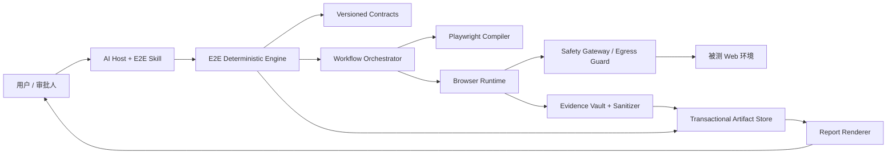

# Spec：PRD 驱动的确定性 E2E 验收与可追踪测试资产系统（V2）

> 状态：Draft for architecture approval
> 日期：2026-07-11
> 规范语言：中文
> 原始设计基线：`# PRD 驱动 E2E 浏览器验收系统从零建设手册.ini`，3246 行，SHA-256 `2d86c8225188a4ddb2d6bb27ad8602f5e2a79f561d8d82de3cb1c7efaff5a191`
> 适用仓库：`mutil-skills`
> 本文优先级：本文审批通过后，替代 2026-07-10 的 E2E Skill 设计文档及原始手册中与本文冲突的架构和契约条款。

## 1. 文档目的

本文定义一套可以直接据此开发、测试和审查的完整系统：输入 PRD 与用户验收诉求，形成冻结的验收范围和确定性执行契约，在受控浏览器与受控网络边界内执行真实链路和故障注入，生成可独立复跑的 Playwright 回归资产，并发布能够从 PRD 追踪到证据的验收报告。

本文不是 Skill 使用说明，也不是任务清单。它是产品语义、架构边界、数据契约、安全不变量、执行语义、测试覆盖、资产事务和完成标准的唯一规格。实现计划和代码只能在本文通过人工审批后产生。

规范词语：

- “必须”表示实现或运行时不可省略的要求；
- “不得”表示必须被确定性代码拒绝的行为；
- “应该”表示默认要求，偏离时必须记录 ADR；
- “可以”表示可选能力，不得影响核心结论；
- 示例用于解释，不降低相邻规范条款的约束力。

## 2. 目标、成功定义与非目标

### 2.1 目标

系统必须实现以下闭环：

```text
权威 PRD 需求包
→ 可追溯的需求与规则模型
→ 经用户确认的验收范围
→ 有限且封闭的覆盖宇宙
→ 可执行 Case 与执行契约
→ 经内容指纹绑定的用户审批
→ 浏览器预检、动作绑定和安全执行
→ 真实链路结果 + 隔离的故障注入结果
→ 诊断、受限自愈和清理验证
→ 可独立复跑的 Playwright 资产
→ 证据完整、可复算结论的报告
→ 单代、事务一致、可恢复的发布资产
```

### 2.2 “100% E2E 达成”的严格含义

本系统不得声称穷举无限输入、所有浏览器、所有后端故障或所有用户行为。“100%”只允许用于一个已经人工确认、冻结且可枚举的结构化验收模型。自然语言 PRD 本身不能由算法证明语义无遗漏；因此正式措辞固定为“对已确认需求模型的覆盖率”，不得简写成“PRD 内容绝对完整覆盖”。

```text
验收宇宙 U = Engine 对已确认 RequirementModel 应用
              versioned CoveragePolicy 后生成的有限 CoverageObligation 集合
```

只有以下条件全部成立，报告才可以使用“本次验收范围 100% 完成”：

1. `RequirementModel`、`CoveragePolicy` 和完整 `U` 已在 Execution Approval 中逐摘要确认；
2. `U` 中每个元素都有 Case，或有通过策略校验的 `manual`/`not-applicable` 处置；
3. 所有必要且可自动执行的 Case 都已执行；
4. 没有未决歧义、未决授权、未知副作用或未知清理状态；
5. 每个已执行 Case 具有满足证据策略的证据；
6. 所有结构化产物、引用和摘要通过审计；
7. 最终 verdict 由确定性规则复算，不由模型或报告渲染器决定。

“设计覆盖 100%”“自动执行覆盖 100%”“通过率 100%”必须分别展示，不得互相替代。

### 2.3 非目标

首期不实现：

- 读取或修改业务源码；
- 单元、组件、API 集成或代码覆盖率测试；
- 自动修复产品代码或自动修改 PRD；
- 把浏览器当前行为反推成预期；
- 通用 RPA、爬虫或任意网页自动操作平台；
- PRD 平台专用登录与抓取；
- 默认性能、无障碍、安全扫描、像素级视觉回归；
- 生产环境不可逆写操作自动化；
- 仅凭浏览器级 mock 证明后端正确性。

## 3. 已知假设和默认策略

### 3.1 默认假设

- 被测对象是 Web 应用；首期只保证受控 Chromium。
- PRD 由宿主转换为 UTF-8 Markdown/纯文本；附件以可读取文件或内容引用提供。
- 大模型负责语义候选生成，不是安全、覆盖率、状态机或 verdict 的权威。
- 非生产环境允许经过授权的可恢复写操作；生产环境默认只读。
- 测试工作区与系统代码仓库可以分离。
- 首期只支持单主机、本地非网络文件系统；共享存储、跨主机运行和分布式锁明确拒绝。
- 可写执行只允许在仓库提供的受控 launcher/容器中运行；任意宿主上的裸 Node.js 进程不属于安全边界。

### 3.2 可配置但必须显式冻结的策略

- 浏览器、视口、语言、时区、色彩模式；
- 环境分类和允许的 origin；
- Case 优先级是否影响必要性；
- 证据保留期限；
- 手工验收项是否阻断 accepted；
- 非生产环境写操作的最大风险等级；
- 运行并发度和超时。

这些策略必须进入 `project-policy.json` 和执行指纹，不能只存在于 Agent 上下文或环境变量中。

## 4. 用户和系统角色

| 角色 | 职责 | 不得承担的职责 |
| --- | --- | --- |
| PRD 提供者 | 提供权威需求包和来源 | 运行时安全判定 |
| 验收审批人 | 确认范围、歧义和执行契约 | 通过笼统同意绕过逐项高风险审批 |
| AI Host | 读取文档、调用 Skill、生成语义候选 | 直接改状态、写 verdict、放行网络 |
| E2E Skill | 编排流程、组织用户交互 | 复制确定性算法或直接执行未门控动作 |
| Deterministic Engine | Schema、ID、覆盖、状态、审批、判定、发布 | 理解自然语言业务含义 |
| Browser Runtime | 预检、绑定、执行、观测、证据 | 改写 expected 或自行增加验收目标 |
| Safety Gateway | 网络和副作用执行门 | 根据 Agent 自然语言授权 |
| Approval Authority | 认证审批人、签发/撤销 capability、原子消费 nonce | 信任本地可修改 grant |
| Lease Authority | 原子分配数据资源、fencing 和清理封锁 | 只按描述性 leaseId 放行写入 |
| Report Renderer | 渲染已判定事实 | 计算或覆盖 verdict |

## 5. 信任边界与威胁模型

### 5.1 不可信输入

以下内容全部视为不可信：PRD 文本、附件、网页 DOM、页面脚本、Network 内容、LLM 输出、用户提供的路径、生成的 Playwright 源码、环境变量值、storageState、历史资产和报告内文本。

### 5.2 必须防御的失败或攻击

- PRD 或网页中的提示注入诱导 Agent 跳门；
- 旧审批被复用到新 Revision、其他环境、其他对象或变更后的请求体；
- 生成测试被直接执行而绕过 Core；
- Service Worker、WebSocket、Beacon 或漏匹配路由让故障注入写入真实服务；
- path traversal、符号链接、TOCTOU 和恶意附件覆盖工作区外文件；
- Trace、视频、DOM、Network 或报告泄漏凭证和个人信息；
- 并发运行覆盖同一资产或复用同一数据；
- 进程崩溃造成测试、manifest、证据和报告跨代；
- 失败后重复提交、清理失败或副作用状态未知；
- 模型通过删 Case、降级断言或修改预期让结果变绿；
- 报告渲染 XSS、证据链接逃逸或任意协议链接；
- 分母为零、未执行项或故障注入结果被统计成真实通过。

### 5.3 核心安全原则

1. 默认拒绝；
2. 审批绑定不可变内容指纹；
3. 每个动作在真正执行前再次检查；
4. 浏览器内拦截不是唯一网络边界；
5. 原始敏感证据不得直接进入可发布目录；
6. 未知副作用等同于不可重试；
7. 任意缺失或不一致只能得到 blocked/incomplete，不能得到 accepted。

## 6. 总体架构



### 6.1 组件职责

| 组件 | 唯一职责 | 输入 | 输出 |
| --- | --- | --- | --- |
| E2E Skill | 语义流程编排与用户沟通 | 用户请求、标准产物 | 候选语义产物、确认请求 |
| Contracts | 运行时结构、版本和迁移 | JSON | parse 结果/Schema |
| Deterministic Engine | ID、闭包、门禁、状态、结果分类、verdict | 已验证产物 | 决策和审计产物 |
| Playwright Compiler | Case/Action Map 到标准测试项目 | 已批准执行包 | staging project |
| Browser Runtime | 浏览器交互和观测 | 不可变 Run Bundle | 原始执行事件 |
| Safety Gateway | origin、method、effect、注入与写入阻断 | 每个网络/动作意图 | allow/deny + 审计事件 |
| Evidence Vault | 隔离原始证据、脱敏、验证、销毁 | 执行事件/媒体 | 可发布证据 |
| Artifact Store | 锁、journal、校验、代际发布、恢复 | generation | active generation |
| Verdict Engine | 唯一结论计算 | 结构化事实 | verdict + reasons |
| Report Renderer | JSON→MD/HTML | final-report | 静态报告 |

### 6.2 依赖方向

```text
e2e-contracts ← e2e-engine
e2e-contracts ← e2e-authority
e2e-contracts ← e2e-gateway
e2e-contracts ← e2e-playwright-runtime
e2e-engine    ← e2e-playwright-runtime（仅纯计划/分类 API）
e2e-gateway client ← e2e-playwright-runtime
e2e-contracts ← e2e-report

禁止：
e2e-contracts → 任何内部包
e2e-engine → Playwright
e2e-engine → e2e-report
e2e-report → e2e-engine
Skill → 运行时 package import
```

`Verdict Engine` 属于 `e2e-engine`，Report 只能渲染其输出。

## 7. 在本仓库中的工程拓扑

为避免污染现有业务中立 `packages/core`，E2E 领域实现使用独立包：

```text
packages/
  e2e-contracts/
  e2e-engine/
  e2e-authority/
  e2e-gateway/
  e2e-playwright-runtime/
  e2e-report/
  skills/skills/testing/e2e/
schemas/e2e/
templates/e2e/
scripts/e2e/internal/
examples/e2e-golden/
docs/superpowers/specs/
```

包名固定为 `@mutil-skills/e2e-contracts`、`@mutil-skills/e2e-engine`、`@mutil-skills/e2e-authority`、`@mutil-skills/e2e-gateway`、`@mutil-skills/e2e-playwright-runtime`、`@mutil-skills/e2e-report`。Authority 与 Gateway 必须作为与不可信测试进程分离的进程启动；Runtime 只能持有客户端。现有 `packages/schema` 继续负责 Skill manifest；E2E 运行时 Schema 归 `e2e-contracts`，不得塞入通用 schema 包。

## 8. 权威来源与 PRD 需求包

### 8.1 来源优先级

1. PRD 明确文字；
2. 用户对具体歧义的确认；
3. PRD 明确引用且内容已纳入摘要的规范/设计；
4. 标为 inference 且经确认的推断；
5. 页面行为只属于 actual，永远不能成为 expected 来源。

同优先级冲突必须生成 ambiguity，不得由 Agent 自行选择。

### 8.2 PRD Revision

所有摘要统一使用 `sha256:<64 lowercase hex>`。JSON 使用 RFC 8785 JCS（UTF-8）；摘要计算时排除对象自身的 `contentDigest` 和签名字段。文本只执行 UTF-8 解码、Unicode NFC 和 CRLF/CR→LF，不 trim、不重排段落。二进制按原始字节摘要。复合摘要使用 JCS 数组 `[{domain, digest, length}]`，不得裸字符串拼接；`domain` 包含 schemaVersion 和 artifactType。数组顺序默认有语义，只有 Schema 标注 `x-canonical-sort-key` 的数组才按该稳定键排序。

Revision 必须对以下内容进行规范化和内容摘要，而不是只摘要附件路径：

```text
revision = SHA-256(
  digestRecord('normalized-prd', normalized UTF-8 bytes)
  + digestRecord('attachment-manifest', JCS metadata)
  + digestRecord('attachment-bytes', each raw attachment)
  + digestRecord('source-identity', JCS identity/version)
)
```

远程附件必须下载到只读 content-addressed source cache，由 Engine 自己重算字节摘要；Host 提供的摘要只能作为传输校验。无法取得字节的附件不得计为权威需求，必须标记 missing-source。URL、文件名或描述变化不能替代内容哈希。

### 8.3 Source Ingestion Sandbox

本地来源只允许用户显式批准的 source roots，逐级 no-follow 打开普通文件；远程来源只允许 HTTPS allowlist host，禁止 IP literal、localhost、私网/链路本地/metadata 地址，DNS 解析和每次重定向后都重新校验。最多 3 次同站重定向；单文件 50MB、总包 200MB、100 个附件、PDF 500 页、压缩展开比 20:1、嵌套 3 层。MIME 与 magic bytes 必须一致；解析器在无网络、只读输入、CPU/内存/时间限额的子进程中运行。超限、加密未知、宏/可执行内容或解析器崩溃都返回 source-blocked。

### 8.3 来源定位

每个 REQ、RULE、歧义答案和视觉断言必须引用 `SourceLocator`：

```ts
type SourceLocator = {
  sourceId: string;
  revision: string;
  kind: 'text-range' | 'heading' | 'page-region' | 'image-region' | 'user-decision';
  locator: string;
  excerptDigest: string;
};
```

引用失效或摘要不匹配时，相关断言必须重新审查。

## 9. 领域模型与稳定身份

### 9.1 稳定实体

稳定 ID 包括 `ASSET`、`REQ`、`RULE`、`FLOW`、`NODE`、`COV`、`CASE`、`STEP`、`ACTION`、`DECISION`、`RUN`、`EVIDENCE`、`GENERATION`。

ID 稳定性由 `semanticKey` 和显式对账决定。Core 不做模糊语义匹配。模型提出旧新映射时必须附带来源、理由和 confidence；低于策略阈值或一对多/多对一变化必须人工确认。

`prd-diff.lineageMappings` 是唯一可发布的实体对账事实，必须按 `(entityKind, semanticKey)` 排序并进入
Lineage Decision Subject。每项固定包含 `entityKind、semanticKey、disposition、previousIds、currentIds、
confidence、confirmation、rationale、sourceRefs`。`preserved` 必须一对一保持相同 ID；`created/deprecated`
只能是零到一或一到零；`split/merged` 必须使用 `authority-confirmed`，Core 禁止自动确认。任一 Revision
内重复 ID/semanticKey、相同 semanticKey 偷换 ID、映射引用快照外实体或映射未被专用 Lineage Receipt
覆盖时，均 fail-closed。

### 9.2 语义变化规则

- 文案变化但验收语义不变：复用 ID，增加 revision；
- expected、角色、状态转换或风险本质变化：复用业务 ID 但增加实体 revision；
- 一个需求拆成多个：旧 ID deprecated，新建多个 ID，并记录 lineage；
- 多个需求合并：新建 ID，旧 ID deprecated；
- 删除需求：保留 tombstone，不再进入 active universe；
- 重新加入：默认复用 tombstone ID，除非业务语义已经改变。

## 10. 验收范围与歧义闭包

范围确认请求必须一次展示：纳入项、排除项、来源、影响 verdict 的歧义、依赖、视觉边界、浏览器矩阵和必要性规则。

每个歧义必须有以下处置之一：

- `answered`：用户回答成为带摘要的权威来源；
- `excluded`：从当前验收宇宙排除并说明影响；
- `manual`：转为手工验收且根据策略决定是否阻断 accepted；
- `pending`：工作流暂停。

只有 `ScopeSnapshot` 的 canonical digest 被用户确认后，才能进入确定性建模。确认后任何纳入、排除、来源或歧义答案变化都使确认失效。

## 11. 需求、规则、状态和可观察性模型

每条纳入需求必须建模：actor、entity、precondition、业务规则、权限规则、验证规则、状态、合法/非法转换、错误语义、恢复语义和 observable outcomes。

可自动验收的 expected 必须映射至少一个 Oracle：

| Oracle | 可证明内容 | 不可证明内容 |
| --- | --- | --- |
| UI | 可见/隐藏、文字、值、数量、可用性、焦点 | 后端持久化正确性 |
| URL | 路由和查询参数 | 页面业务数据正确性 |
| Network | method/status/经批准字段摘要 | 服务端内部逻辑 |
| State transition | 前后可观察状态 | 不可观察内部状态 |
| Reload persistence | 刷新后状态 | 跨系统最终一致性，除非有等待协议 |
| Visual reference | 选定区域的视觉差异 | 无规范时的主观美观 |

无法形成 Oracle 的要求必须标为 manual 或 unsupported，不得生成空泛断言。

## 12. 覆盖宇宙与 Case 生成

### 12.1 覆盖闭包算法

Engine 从已确认模型生成 `CoverageObligation[]`。算法固定为：对每个 active REQ，读取其显式 `applicability`；对每个 applicable RULE、关键 NODE、必需 ACTOR、必需 TRANSITION 和 CoveragePolicy 要求的 SCENARIO 分别创建 obligation，而不是生成完整笛卡尔积。只有 RequirementModel 中显式列为 `coupledDimensions` 的维度才做组合；独立输入维度按 CoveragePolicy 指定的等价类/边界/pairwise 生成。所有输入集合、排序键、policyVersion 和 pairwise seed 都进入 universeDigest。

`critical node` 固定指：entry/exit、产生 Oracle 的节点、状态转换节点、权限决策节点、effect 非 read 的动作、错误/恢复分支。`required actor/transition/scenario` 必须是 RequirementModel 中显式枚举的值；Agent 候选没有进入已确认模型时不构成分母。每项 obligation 必须包含来源、适用条件、必要性和处置：

```ts
type CoverageDisposition =
  | { kind: 'automated'; caseIds: string[] }
  | { kind: 'manual'; manualProcedureId: string; blocking: boolean }
  | { kind: 'not-applicable'; policyCode: string; rationale: string; decisionGrantId: string;
      decisionReceipt: CoverageDispositionDecisionReceipt };
```

`not-applicable` 不能仅靠自然语言理由或一个可任意填写的 ID 通过。每一项必须由登记的 `coverage-approver` 使用专用 `coverage-disposition-decision-receipt/v1` 签名，receipt 精确绑定 obligationId、requirementModelDigest、coveragePolicyDigest、`not-applicable`、版本化 policyCode 和 rationale；Builder 与 Artifact Store staging 都必须从落盘事实重建 subject digest 并独立验签。任何 ID、模型、策略、理由或签名错绑都阻断发布。

### 12.2 默认场景类别

对适用需求至少评估：

- happy path；
- 等价类和边界值；
- 必填、格式、长度和组合校验；
- 角色/权限正反路径；
- 合法和关键非法状态转换；
- 空态、部分数据、分页边界；
- HTTP 错误、网络错误、超时和恢复；
- 重复点击、并发提交、刷新、返回导航；
- 会话过期和权限变化；
- 数据加载中与最终一致性等待；
- PRD 要求的视觉、响应式、多浏览器、可访问性或性能场景。

相互独立条件可采用 pairwise；业务强关联组合必须显式列出。任何裁剪必须保留组合模型、生成算法版本和省略依据。

### 12.3 Case 原子性

一个 Case 可以有多个步骤，但只能有一个主要失败命题。Case 必须声明：来源、目的、必要性、角色、环境约束、数据租约、前置、步骤、Oracle、证据策略、执行模式、effect、清理、超时和重试策略。

Case 不能包含 CSS selector、一次性真实记录 ID、秘密或未解析歧义。定位器在绑定阶段产生。

## 13. 审批模型与不可重放执行契约

### 13.1 两个用户确认门

保留两个正常确认门：

1. Scope Approval：确认 PRD 候选、纳入/排除、歧义答案和模型生成边界；
2. Execution Approval：确认最终 RequirementModel、CoveragePolicy、完整 obligation 集合、Case、环境、身份/数据和副作用。

第二次确认必须向用户展示结构化模型变更摘要、所有 N/A/manual 处置和覆盖分母；它同时冻结 `requirementModelDigest`、`coveragePolicyDigest`、`universeDigest`、`caseDigest`。因此模型即使由非确定性 LLM 候选产生，只有被第二次确认的结构化结果才是 verdict 的输入。LLM 模型 ID、版本、system prompt digest、tool-output digests、采样参数和候选选择记录进入 `semantic-generation.json`，用于审计但不替代用户确认。

Scope Approval 后，Authority 可以签发单独的短期 `DiscoveryCapability`，它只允许冻结的 bootstrap/static 导航请求和 DOM 读取，用于只读 preflight、页面身份和 locator binding；不得执行 Case、业务搜索、表单提交、下载、未知业务 GET 或任何写入。Lease Authority 可以建立 `tentative` lease reservation，但在 Execution Approval 前不能 activate 或用于写入。Action Map、tentative lease/resource fingerprint、环境和角色预检全部冻结后才请求最终 Execution Approval。任何重新绑定、角色/环境/lease 变化都会撤销旧 grant，并回到 awaiting-execution-approval。

### 13.2 Approval Authority 与审批指纹

Approval Authority 是 Engine/Gateway 都信任的独立接口。首期本地实现使用 OS 登录用户认证 + 明确审批 UI + Authority 持有的 Ed25519 私钥；组织环境可接企业 OIDC/RBAC。私钥不得写入 testWorkspace。Grant 必须包含 issuer、keyId、subject、role、issuedAt、expiresAt、grantId、capabilities、签名和撤销序列。Gateway 通过受信公钥和撤销列表验签；本地 JSON 不能自行成为有效 Grant。执行审批只允许 `e2e-approver`；Scope 与 Lineage 决定分别只允许 Authority 已登记的 `scope-approver` 与 `lineage-approver`，高风险策略可以要求双人批准。

审批身份必须来自 Authority 配置的可信身份注册表或企业 IdP 映射，subject 与规范化 roles 必须精确匹配；调用方提交的 `ApproverIdentity.roles` 只是待核对声明，不能自行取得权限。每次签发还必须提交 `approvalSessionRef`，由受信 OS/SSO 认证边界重新解析当前主体并与声明 subject 一致。本地实现以 `LocalApprovalAuthority.open({ statePath, stateEncryptionKey, testWorkspaceRoots })` 打开受保护的 SQLite 状态；`stateEncryptionKey` 必须由 Git 外 Secret Provider 提供且为 32 bytes，`statePath` 必须位于所有测试工作区之外。数据库中的各用途私钥只保存 AES-256-GCM 密文（独立随机 IV、认证标签和按 key 分类 AAD），后续重启复用同一外部密钥和身份注册表摘要。错误密钥、issuer、keyId 或注册表摘要变化时必须 fail closed，不能静默创建新 Authority。

Authority 使用可信时间签发，最大 TTL：read 运行 8 小时，write capability 15 分钟。Gateway 保存单调 `lastSeenIssuedAt` 和撤销序列；时间回拨、未知 keyId、过期、撤销数据过旧都 fail closed。离线模式只允许 local/test 的 read。

#### 13.2.1 Scope/Lineage 专用 DecisionReceipt

范围与血缘决定不得由待发布 Artifact 草稿加通用 Artifact 签名自批。Authority 必须使用独立 Decision
Ed25519 key；私钥不暴露任意 `signDigest`。跨进程 verifier material 固定 issuer、keyId、算法、SPKI
与 publicKeyDigest，替换 key、purpose，或复用 Artifact/freshness/privacy 签名一律失败。

决定主题使用两个显式投影：`scope-decision-subject/v1` 只覆盖
`includedReqCandidates/exclusions/ambiguities/dependencies/visualScope/browserScope`，明确排除
`scopeDecision`；`lineage-decision-subject/v1` 只覆盖
`previousRevision/currentRevision/sectionChanges/lineageMappings/impactedEntityIds`，明确排除 `lineageReview`。投影
Schema strict，未知安全字段 fail closed；主题任一字段变化都必须改变 digest。
每个 `resolved` ambiguity 必须同时包含 `decisionId` 与非空 `resolution`，使用户的实际答案进入
Scope Decision Subject；只有问题或“已解决”状态而没有答案时必须 fail closed。`pending` ambiguity
不得提前携带 `resolution`。

`acceptance-scope` 与 `prd-diff` 从 Schema 2.0.0 起使用判别联合：`pending` 只含 decisionId/status 且
不得带 receipt；`approved/rejected` 必须带 receipt，并要求 receipt.kind、decisionId、decisionStatus 与外层
一致。receipt 还必须绑定完整 decisionSubjectDigest、Authority 生成的 checkedAt/nonce、登记 approver、
kind-specific purpose/key/signature。v1 一律 `migration-required`，不得猜测迁移为 approved。

Engine 在首次构建和 Store staging 审计两次从本代 Artifact 重建主题并验证专用 receipt；verifier 缺失、
验签异常、主题/status/decisionId 不一致均 fail closed。Verdict 的 pending/rejected 与 FinalReport 的 scope
approval 只允许来自这一验证后的决定；FinalReport 独立重算 scope subject digest，并记录 terminal receipt
的 signedDigest。Golden helper 不得内置 approved receipt：外层必须显式传决定和登记审批人，由 helper
请求 Authority 签发；缺决定时只能保持 pending，不能发布 accepted。

审批不得只绑定 actionId。每个 `ApprovalGrant` 必须绑定：

```ts
type ApprovalSubject = {
  schemaVersion: string;
  assetId: string;
  prdRevision: string;
  scopeDigest: string;
  requirementModelDigest: string;
  coveragePolicyDigest: string;
  universeDigest: string;
  caseDigest: string;
  actionMapDigest: string;
  policyDigest: string;
  environment: string;
  baseOrigin: string;
  actor: string;
  actionCapabilities: ActionCapability[];
  expiresAt: string;
};

type ActionCapability =
  | {
      capabilityId: string; nonce: string; transport: 'browser-local'; actionId: string; effect: 'read';
      operation: 'dom-read' | 'screenshot' | 'local-navigation'; maxUses: number;
    }
  | {
      capabilityId: string; nonce: string; transport: 'http'; actionId: string; effect: 'read' | 'reversible-write';
      requests: HttpIntent[]; dataLeaseId: string | 'not-applicable';
      cleanupPlanDigest: string | 'not-applicable';
    }
  | {
      capabilityId: string; nonce: string; transport: 'websocket'; actionId: string; effect: 'read';
      origin: string; path: string; maxInboundMessages: number; maxBytes: number;
    }
  | {
      capabilityId: string; nonce: string; transport: 'gateway-injection';
      actionId: string; caseId: string; runId: string; attemptSlot: number;
      request: HttpIntent; response: CanonicalInjectionResponse;
      expectedMatches: number; expectedOrder: number; upstreamForwarding: 'forbidden';
    };

type HttpIntent = {
  intentId: string; method: string; canonicalOrigin: string; pathMatcher: RestrictedPathMatcher;
  queryPolicy: QueryPolicy; payload: CanonicalPayload | { kind: 'no-body' };
  targetFingerprint: string | 'not-applicable'; maxRequests: number;
  expectedOrder: number; timeoutMs: number; redirectPolicy: 'deny' | CanonicalOrigin[];
};

type CanonicalInjectionResponse = {
  kind: 'http-response'|'connection-reset'|'timeout';
  status: number|'not-applicable'; headers: Array<{ name: string; value: string }>;
  body: CanonicalPayload|{ kind: 'no-body' }; delayMs: number;
};
```

Authority 使用 CSPRNG 生成全局唯一 UUIDv7 capabilityId 和 256-bit nonce；二者、maxUses、有效期及完整 capability 都进入签名 subject。唯一性域是 Authority keyId + capabilityId，nonce 状态持久化至少到 grant 过期后 30 天。用户决定签名覆盖 canonical ApprovalSubject digest、显示摘要 digest 和 Authority 元数据。任何字段变化或过期都必须重新确认。一个 action 可以关联多个精确 HttpIntent；Gateway 拒绝未关联请求、超出次数、乱序写入和扩大目标。不可语义检查的 WebSocket 写、WebRTC、FTP、file/custom scheme、下载和未知协议在首期永久拒绝。

### 13.3 Capability 原子保留与消费

每个会产生外部 effect 的执行尝试必须由 Authority/Gateway 对 `(assetId, generationId, prdRevision, runId, caseId, grantId, capabilityId, actionId, attemptId)` 原子 CAS：`available → reserved → completed | unknown`。只有 Gateway 成功写入精确上下文的 `reserved` 后才允许请求出站；成功取得上游结果后写 `completed + outcomeDigest`。进程在 reserve 后崩溃、连接断开或上游结果不明时写/保留 `unknown`，该 capability 永不自动重用，必须人工对账并重新签发。并发请求只有一个可以取得 reservation。read capability 可以有 `maxUses` 计数，但同样由 Gateway 原子递减。

本地 Authority 必须在 `BEGIN IMMEDIATE` 事务中原子持久化加密后的用途私钥、grant、撤销序列、nonce 使用计数、完整执行上下文 reservation、ready discovery preflight、manual result 防重放集合与 Attempt append-only 日志。Authority/Lease SQLite 位于任一测试工作区内必须拒绝打开；加密密钥不得与数据库共同持久化。相同进程的多实例先异步串行化，禁止 `DatabaseSync.busy_timeout` 阻塞事件循环；不同进程由 SQLite 锁互斥。同步验签/追加 API 遇到同进程异步事务时快速失败，不能等待形成死锁。

### 13.4 环境和 effect 策略

| 环境 | read | reversible-write | irreversible |
| --- | --- | --- | --- |
| local/test | 执行契约确认后允许 | 逐项批准 + 数据租约 + 清理 | 默认拒绝，可由项目策略彻底禁用 |
| staging | 执行契约确认后允许 | 逐项批准 + 恢复验证 | 默认拒绝 |
| production | 明确只读批准 | 默认拒绝；仅隔离租户且可证明恢复时例外 | 永久拒绝自动执行 |
| unknown | 拒绝 | 拒绝 | 拒绝 |

支付、删除、发券、通知、外部消息、真实审核、生物识别、不可恢复状态迁移默认属于 irreversible。Agent 不得降级 effect。

## 14. 权威状态机和事件日志

状态机由单一表驱动；Skill、Engine 和审计工具不得各维护一份顺序。

```text
created
→ source-frozen
→ awaiting-scope-approval
→ scope-approved
→ modeled
→ coverage-audited
→ discovery-approved
→ preflight-readonly
→ binding-draft
→ lease-reserved
→ awaiting-execution-approval
→ execution-approved
→ compiled
→ running-real
→ running-injection
→ diagnosing
→ finalizing
→ publication-ready
→ [atomic commit]
→ accepted | rejected | incomplete |
  pending-decision | input-blocked | environment-blocked |
  safety-blocked | automation-blocked | artifact-blocked | migration-required
```

合法回边固定为：`preflight-readonly → input-blocked → preflight-readonly`；`binding-draft/lease-reserved/compiled → awaiting-execution-approval`（任何审批主题变化）；`execution-approved → binding-draft` 只能先撤销 grant。禁止在 final grant 后静默修改 Action Map 或 Lease。

`finalizing` 在 staging 内生成不可变 `FinalizationSnapshot`，其中已有唯一 verdict、VerdictInput digest、final-report 和全部文件摘要；验证成功进入 publication-ready。只有可发布 verdict 才执行原子 commit，同时切换 active pointer 并使 snapshot verdict 成为终态。`artifact-blocked` 和 `migration-required` 是 generation 外、由 Authority 签名审计的非发布终态，合法边为 `finalizing|publication-ready → artifact-blocked|migration-required`，不切 active。generation 内事件以 publication-ready 结束；commit journal 是 generation 外审计记录。不得先提交再计算 verdict。

每次转换是追加事件，至少包含 `eventId`、前后状态、输入摘要、输出摘要、actor、时间、reason 和 engineVersion。当前状态由事件重放得到；可保存 snapshot，但 snapshot 必须能由事件校验。

Attempt 事件使用独立 key/purpose。执行器只能调用 `appendAttemptEvent({ context, event })` 提交完整 asset/generation/PRD/run/case 上下文和事件；Authority 自行校验 slot/sequence/前链/时间单调/started→terminal 转换，内部计算 event digest 后签名，并把事件写入持久 append-only 日志。所有 `passed|failed` terminal 必须显式携带 `reservationId + outcomeDigest`；Authority 必须精确查得同一 completed reservation，并复验 attemptId、上下文、Grant、Capability 与 effect，不能在同上下文中模糊匹配任意 reservation。Gateway 签名发布审计必须保存同一 reservationId、完整 AttemptContext、status 和 outcomeDigest，Engine/staging 再逐条复算。Authority 不得暴露任意摘要签名 oracle。

可恢复写的 `outcomeDigest` 不得由 Runner 传入任意 opaque digest。Gateway 必须使用 Ed25519 和专用 `purpose=execution-outcome-receipt/v1` 签发结构化 `ExecutionOutcomeReceipt`；签名前的完整 preimage 至少包括：AttemptContext，Grant/Capability/Action/Attempt/Reservation 标识，完整 ReversibleWriteCapability snapshot 及全部批准 HTTP Intent，effect/status/effectObservation，Runner 结果摘要，Gateway policy、executionSessionId、approved request set 摘要及 received/forwarded/blocked 计数，cleanupPlanId/cleanupPlanDigest/leaseId/cleanup status/result/lease receipt，以及 evidenceIds/evidenceSetDigest 和 completedAt。Authority reservation 的 `outcomeDigest` 必须精确等于回执 `signedDigest`。staging 必须从回执内完整 Capability 重算 `approval-capability/v1`，与 Authority freshness 批准的 RunBundle capability record 精确一致；不得只相信 opaque request-set digest。同一 Case 可能有多个写动作，因此资产必须以 `browser-results.executionOutcomeReceipts[]` 按唯一 actionId 保存，不得用“一 Case 一回执”覆盖多个副作用。

回执至少经过三次独立复验：loopback bridge 验证签名和 action/lease/cleanup/Runner binding；编译生成的隔离 Playwright 子进程从白名单环境取得公钥材料，自行规范化 JSON、重算 domain-separated digest 并验 Ed25519；staging 从落盘资产重读回执，逐动作对齐 Attempt、Gateway completed reservation、Capability preimage、cleanup 和 evidence。每个写 Gateway 必须生成独立 `executionSessionId`，其所有 forwarded/blocked request event 都写入同一签名审计；staging 按 session 精确复算 received/forwarded/blocked，禁止把同 action 的只读导航或其他 Gateway 请求混入包含关系检查。任一验签器缺失、签名错误、字段错绑、回执缺失或一对多映射都必须拒绝发布，而不是降级为普通 incomplete 报告。不可变 cleanup plan registry 必须证明 `cleanupPlanId → cleanupPlanDigest → 可执行计划`：计划完整 preimage、批准 cleanup intent、验证探针、executor 身份和 timeout 必须进入摘要，同一 ID 不得替换定义或 executor，staging 还要从 `cleanup-results` 落盘定义独立重算。

Authority/Lease RPC 固定为 `POST /v1/authority-rpc` 的 loopback-only 协议。每个调用方使用独立 256-bit 会话密钥，以 HMAC-SHA256 认证包含 `clientId、requestId、256-bit nonce、operation、完整 payload/payloadDigest、issuedAt、expiresAt` 的规范请求；TTL 不得超过 30 秒，Host 在验 MAC 后、调用 handler 前消费 requestId/nonce，拒绝同进程生命周期内重放。Host 的每个成功或业务错误响应必须以专用 `authority-rpc-response/v1` Ed25519 key 签名，并绑定原 request digest、operation、nonce、issuer/keyId、状态和完整 result/error；客户端必须固定 SPKI 摘要并独立重算。只允许版本化固定 operation：Runner 的 `write.verifyForSubject.v1`、`lease.verifyTarget.v1`，以及 Gateway 的 `gateway.write.verifyForSubject.v2`、`gateway.write.reserveForSubject.v1`、`gateway.write.complete.v1`、`gateway.write.markUnknown.v1`。Gateway 的 verify payload 必须同时包含签名 Grant 与由当前冻结执行计划独立重建的完整 `currentSubject`，Authority 必须执行 `verifyForSubject`；禁止仅复验旧 Grant，或用 `grant.subject` 代替当前计划主体。reservation 响应还必须精确回绑 grant/capability/action/attempt/context，终态确认不得只信 HTTP 2xx。普通结构对象、内进程测试客户端、错误公钥摘要或错误 transport mode 在生产写 Runner 中一律 fail closed。参考 Host 必须由受信编排器通过父子 IPC 启动独立 OS 进程；Host 自行打开工作区外的 Approval/Lease SQLite，状态加密密钥和 RPC 会话密钥不得进入 argv、环境变量、测试工作区或 Playwright 子进程。编排器只把 endpoint、调用方 credential 和固定公钥材料交给对应客户端，并在结束时关闭 Host、清零内存会话密钥。系统 Golden 必须断言 Host PID 不同于编排器，并在这一进程边界下完成真实 Chrome 写入、reservation 终态、清理与发布。

暂停必须保存精确 `resumeState`、required input/decision IDs、冻结的 Case 队列和摘要。恢复时只接受引用这些 ID 的响应。不得通过手工补文件伪造节点完成。

## 15. 测试数据、身份和清理闭环

### 15.1 身份

- 每个角色独立 Browser Context；
- storageState 只以 secret reference 传递，不复制进资产；
- 运行前验证角色信号和权限，不只验证“已登录”；
- 会话过期属于 input-blocked；
- 最小权限原则；
- 日志不得输出 Cookie、Token 或 storageState 内容。

### 15.2 Data Lease

每个会写入或依赖可变数据的 Case 必须从 Lease Authority 原子 acquire `DataLease`。Lease 包含 runId、不可伪造 resourceKey、resourceFingerprint、scope、owner、fencingToken、exclusive/shared、创建方式、初始状态、到期、验证和 cleanup plan。相同 resourceKey 的 exclusive lease 在前一 lease `released` 或 `quarantined` 前不得再次分配；Gateway 在每次写请求前校验 capability.dataLeaseId、targetFingerprint、resourceKey 和最新 fencingToken。

本地 Lease Authority 使用 `LocalLeaseAuthority.open({ statePath, testWorkspaceRoots })` 在全部测试工作区之外持久化 lease、resource owner 与 fencing counter。相同状态文件的多实例竞争同一 resourceKey 时只能有一个成功；释放后重新申请的 fencing token 在进程和机器重启后仍必须单调递增。写 Runner 只接受 Authority 工厂创建并带不可伪造运行时来源绑定的 approval/lease clients；测试模式只能接受 `in-process-test`，生产模式只能接受 `authenticated-rpc`，且 Write 与 Lease 客户端的 Authority 公钥摘要必须同时等于运行契约固定值。在访问页面前调用 `authority.verifyForSubject()` 和 `lease.authority.verifyTarget()`，并将 capability 的 leaseId、fencingToken 及全部 request targetFingerprint 与当前 Lease 精确比较。调用方提供的 `grantValid`/`leaseValid` 布尔值、结构相同的伪 verifier、错误 transport 或自行替换的 RPC 公钥都不具备授权语义。

数据来源仅允许：

- 用户提供的隔离测试数据；
- UI 创建且动作已授权；
- 用户明确授权的 fixture API；
- 可重置 fixture app。

不得根据 Network 猜测私有 API 造数据。

### 15.3 清理

写操作 Case 必须在执行前记录 before verification，执行后记录 after verification，并执行/验证 cleanup。VerificationPlan 必须来自已确认模型或用户提供协议，明确读取 Oracle、字段 allowlist、版本戳、最终一致性等待和外部副作用清单；单纯 UI 未变化不能证明未产生通知、审计、支付或异步任务。无法完整验证所有副作用时 effect 必须升级为 irreversible。清理状态只有：`not-needed`、`verified-clean`、`failed`、`unknown`。`failed` 或 `unknown` 必须阻断 accepted、隔离 resourceKey，并禁止自动重试。

## 16. 页面预检与动作绑定

### 16.1 预检

预检验证：URL/origin、TLS/导航、登录、角色、页面身份、关键控件、页面健康、必要数据、浏览器能力、安全网关和证据目录。页面身份至少组合 URL、title、heading、ARIA signal 和可选业务标识，不能只依赖单一文本。

### 16.2 动作绑定

绑定必须记录每个 locator 候选的策略、作用域、唯一性、可见性和观测证据。优先级：role+accessible name、label、placeholder、testid、稳定业务属性、上下文文本、CSS fallback。禁止无依据 `nth()`、绝对 XPath、构建产物 class 和跨页面全局文本定位。

绑定阶段发现的新动作、新 origin、新 method、新 effect 或新数据对象都会改变 actionMapDigest，必须重新计算执行审批；不得只补充 actionId。

## 17. Playwright 编译与独立执行

### 17.1 编译产物

`current/regression` 必须是标准 Playwright 项目，包含 package、config、tests、fixtures、safety、network policy、evidence policy、manifest 和 README。每个测试带 ASSET/PRD/REQ/RULE/COV/CASE/revision/mode 注解。

生成源码不是 LLM 自由文本：确定性编译器只接受严格 Case/Action AST，使用仓库内签名固定模板生成 config、fixture 和 test；PRD 文本只作为 JSON 数据经过转义。禁止生成任意 import、顶层语句、globalSetup、自定义 reporter、npm lifecycle script、`child_process`、原生网络或文件系统调用。项目必须包含 lockfile、toolchain manifest、模板 digest 和 source integrity manifest；安装使用 `--ignore-scripts`。

### 17.2 不可绕过的运行门

生成测试不得直接使用裸 `page` 执行业务动作。它必须使用本地生成的 `safePage` fixture 和不可变 `run-bundle.json`：

```ts
test('CASE-ORDER-APPROVE-001', async ({ safePage, runGate }) => {
  await runGate.requireCase('CASE-ORDER-APPROVE-001');
  await safePage.click('ACTION-APPROVE');
});
```

`safePage` 是防误用层，不是最终安全边界。可写运行只能通过受控 `prepare-regression-run` + `run-regression` launcher：使用专用低权限用户/容器、只读源码和宿主挂载、临时可写目录、无宿主凭证、禁任意子进程、Node/Chromium 只能连接 Gateway、禁下载和远程调试、CPU/内存/磁盘限额、ephemeral profile，并验证 Chromium sandbox 生效。Gateway 对每个请求独立验签和消费 capability；即使测试源码被修改，也不能扩大请求。

Runner 不得接受调用方自报的 `sandboxHealthy/gatewayConnected` 布尔值。隔离后端必须使用独立 `runtime-isolation-attestation/v1` Ed25519 key 签发短期证明，完整绑定 run/asset/generation/PRD/Case、后端种类与实例、专用低权限 UID、只读 source digest、临时 HOME、零宿主凭证挂载、网络 default-deny 与精确 allowed endpoints、禁 QUIC/远程调试/下载、禁任意子进程、允许的 executable digests、浏览器 sandbox/ephemeral profile、CPU/内存/磁盘/墙钟限额，以及 Authority RPC 公钥摘要。上述可审批预期不得由 launcher 临时拼装：可恢复写必须把 `RuntimeIsolationPolicy`（source、允许后端、Gateway/允许端点、允许 executable 摘要、资源限额、Authority RPC 公钥摘要、隔离 Authority SPKI 摘要）写入同代 Execution Contract，并在 Run Bundle 固定其 `runtime-isolation-policy/v1` 规范摘要；纯只读运行必须明确记录 `runtimeIsolation=null` 与 `runtimeIsolationPolicyDigest=not-applicable`。Runtime 必须先复算这组资产绑定，再固定隔离 Authority SPKI 摘要、重算证明签名和全部预期字段，才能创建不可伪造的 `production-isolated` 会话；普通结构对象与 `test-only` 会话都不能进入生产 launcher。生产 launcher 还要复核 Write/Lease RPC 客户端绑定同一 Authority 公钥。参考仓库可以提供 `test-only` 会话运行 Golden，但这不构成生产隔离证明。

本地参考 launcher 必须为每个 fresh Run 启动仅监听 `127.0.0.1` 的 Controlled Write Bridge，并生成 CSPRNG 256-bit Bearer RunGate；bridge 只接受固定 `POST /v1/reversible-write`、受限 body 大小和 exact typed action，拒绝远端连接、未知/额外字段和并发重复。action 一旦进入 launcher 就永久消费，任一执行、cleanup、finalize 或 proof 异常都会终止 bridge，禁止在副作用不明时自动重试。生成的纯写 Playwright 项目不启动第二个浏览器，只向 bridge 提交语义动作；bridge 内部持有受信 Runner 输入，核对 Grant capability、Lease、cleanup plan 后驱动受控浏览器与 Gateway。无论 Runner 结果如何都执行 cleanup 流程；cleanup 抛错也转为 unknown 并调用终态回写，未 `verified-clean` 时不得返回 passed。只有 Authority/Lease/Gateway 摘要与 evidence IDs 完整时返回成功证明。

`pnpm exec playwright test --list` 可以离线独立执行；真正复跑是“使用同一测试源创建一个全新 Run”，必须重新完成 preflight、数据 lease、必要绑定校验和 fresh Execution Approval，再生成新的 runId/run bundle。缺 launcher、Gateway、Authority 或有效 capability 时，直接 `playwright test` 只能执行明确标记为 hermetic-read 的 local fixture Case，其余 fail closed。这里的“脱离 AI 可复跑”表示不依赖 LLM，不表示复用旧授权或脱离安全服务。

编译质量门：TypeScript、`playwright test --list`、manifest 对账、source parse、禁用 `.only/.skip/.fixme/.fail/.todo`、无空 Oracle、无秘密、所有 ready Case 一一对应、所有生成文件 hash 已登记。blocked Case 必须作为独立 typed 集合输入受信编译器，只写入生成 Run Bundle 与 Discovery 签名主题；不得进入 spec 源码、caseMappings 或 reporter discovery。executable 与 blocked Case ID 必须互斥，发布审计要求二者对 active Case 精确闭合。

### 17.3 可信 Discovery 证明与源码闭环

生产 Discovery API 只接受严格 typed Case/Action AST，不能接受调用方提供的源码 bytes、`playwrightCaseIds` 或 list stdout。受信 ReadOnly Compiler 在新临时 cwd 中生成固定模板，runner 必须重读其全部输出并核对编译器返回摘要后，才允许加载这些源码。`--list` 直接使用已解析的本地 `@playwright/test/cli`，固定为 `node @playwright/test/cli test --list --reporter=json`；禁止 `npx`、自动下载、网络、业务环境变量、浏览器启动和业务测试执行。Case ID 只从 JSON reporter stdout 推导。

独立 Discovery Authority 使用专用 Ed25519 密钥签发 `regression-discovery-attestation/v1`。签名 subject 必须绑定 assetId/generationId/prdRevision、compiler input digest、模板版本标识、全部 sourceFiles 的 relativePath/digest/byteLength、Case 映射、明确 reasonCode 的 blockedCases、Node/Playwright/CLI 标识、固定命令、exitCode=0、stdout digest、exact discovered Case IDs 和 sourceSetDigest。Discovery 必须在签名前扫描受信生成的 spec 源码，发现 `test.skip/fixme/fail/only/todo` 或对应的 `test.describe` 聚焦/跳过形式即拒绝；blocked Case 不得出现在源码、映射或 list 中。`compilerDigest` 与 `templateDigest` 是受控实现的版本标识，不宣称测量运行中字节；`playwrightCliDigest` 是实际 CLI bytes 的独立测量。

Schema 2.0.0 `regression-manifest.listResult` 同时登记 Case IDs、stdout digest 和完整 attestation。Builder 首次审计与 Artifact Store staging 审计都必须从 supporting file 的实际 bytes 重算 `generation-file:<path>` digest、byteLength 和完整 source set，并以固定 verifier material 跨进程验签。manifest、attestation、实际文件或活跃 Case 的集合有任何缺失、额外、重复或错绑都阻断发布；旧 v1 一律 `migration-required`。失败路径自动清理临时目录；成功路径由调用方在发布完成或失败的 `finally` 中清理。

## 18. 浏览器运行与调度

### 18.1 执行顺序

同一数据租约、状态链或写副作用的 Case 串行；只有无共享状态、只读且独立 Context 的 Case 才可并行。调度计划是 Run Bundle 的一部分。

### 18.2 步骤协议

每个步骤产生 begin/end 事件，记录 expected、actual、before/after fingerprint、Oracle 结果、Network correlation、证据引用和时间。导航或动作后使用显式可观察条件；`networkidle` 不能作为唯一稳定条件。

### 18.3 超时与重试

- 断言等待按 Case 声明，禁止任意 sleep；
- 每次 attempt 的 `EffectObservation` 只能是 `not-applicable | proven-not-applied | applied | unknown`；
- read Case 的 automation failure 且 observation=`not-applicable` 最多重试两次；
- reversible-write 只有 VerificationPlan 证明 `proven-not-applied` 且 Gateway reservation 可安全作废时才可重新签发并重试；
- `applied` 或 `unknown` 永不自动重试；
- business failure 不重试；
- 故障注入失败先在注入沙箱内重跑，不能自动转真实链路。

## 19. 网络安全网关与故障注入

### 19.1 两层阻断

`page.route()` 或 `browserContext.route()` 只能作为浏览器内辅助观测层。唯一安全和注入执行点是浏览器进程之外的 Egress Guard；所有请求都必须强制经过 Gateway，Gateway 根据签名 capability 决定 inject/block/forward 并签名审计计数。

参考实现必须是可检查 HTTP 语义的应用层代理，而不是只能看到 HTTPS `CONNECT` 目标的普通转发代理。Browser Runtime 必须在受控进程/容器中启动 Chromium：禁止浏览器直接出网，只允许连接 Egress Guard；禁用 QUIC/UDP 直连；DNS 由网关解析；目标 HTTPS 通过项目安装的临时测试 CA、受控反向代理或环境侧服务网格终止，使网关能够检查最终 method/origin/path。无法建立这一网络强制边界时，故障注入只能在 local/test 隔离环境运行，且系统不得宣称“真实服务器零写入”。

运行时必须：

- 禁用或阻断 Service Worker，除非该 Case 明确测试 Service Worker 且使用专用隔离环境；
- SSE 只允许签名 read intent，重连计入 maxRequests；Beacon 按普通 HTTP intent；跨域 iframe 每个 origin 独立授权；
- WebSocket 首期只允许 read-only 订阅：握手 origin/path、最大入站消息数/字节受限，任何客户端业务帧拒绝；
- 禁止 WebRTC、QUIC、UDP、FTP、file/custom scheme、未批准下载和未知协议；
- 默认拒绝未声明 origin；
- 静态资源 GET/HEAD 只有 MIME、path 和无业务 query 同时匹配 project allowlist 才可作为 read；其他业务请求无论 method 均为 `unknown-effect`，必须由已确认 endpoint policy 明确分类，否则拒绝；
- 对重定向后的最终 origin 重新校验；
- 禁止 DNS rebinding、localhost/metadata address 意外访问和 scheme 漂移；
- 用 correlation ID 关联 browser action 与 gateway decision。

### 19.2 故障注入隔离

每个 Injection Case 使用新 Browser Context 和独立 Gateway policy。注入规则必须作为签名 capability 由 Gateway 执行，精确声明 method、canonical origin、受限 path matcher、query/payload 特征、响应模板摘要、次数和顺序。Browser route 不得产生正式注入结果。宽泛的 `**/api/**` 不得通过安全审计。

运行分为 `bootstrap` 和 `case` 两个 Gateway 阶段。bootstrap 只允许 Execution Approval 中冻结的 HTML/JS/CSS/font/image 与必要 read API intent，集合和 maxRequests 已签名；页面 identity ready 后 Gateway 原子切换到 case 阶段，不能再扩大 bootstrap。零转发约束针对注入目标和所有 write/unknown/unapproved 请求，不要求已批准静态/read bootstrap 为零。

故障注入模式必须满足：

```text
gateway received = matched + blocked + forwarded
injection matched count = expected count
injection-target upstream-forwarded count = 0
unapproved/unknown-effect forwarded count = 0
unexpected origin/protocol forwarded count = 0
bootstrap forwarded count <= signed bootstrap maxRequests
```

任何计数未知或不满足，Case 状态为 `safety-blocked`，不能根据 UI 表现判 passed。浏览器注入只能证明前端在指定模拟响应下的行为；报告必须写明未证明后端故障行为。

### 19.3 URL、Matcher 与 Payload 规范化

Gateway 和 Engine 必须复用 `e2e-contracts` 的同一 canonicalizer。URL 通过 WHATWG URL 解析：scheme/host 小写、IDN 转 ASCII、删除 host 尾点、显式规范默认端口、IPv6 使用压缩规范形式；拒绝 userinfo、fragment、反斜杠、无效 percent encoding 和解析前后不一致。path 先按 URL 标准移除 dot segments，再对未保留字符做唯一 percent 编码；query 保留重复 key 和顺序，匹配策略必须逐项声明。Matcher 只允许 exact 或逐 segment 参数（有长度/字符集约束），禁止通用 regex/glob，最多 50 segments/8KB。

Payload：JSON 使用 JCS；`application/x-www-form-urlencoded` 保留重复字段并按声明顺序规范；multipart 每个 part 必须声明 name、content-type、大小和独立 digest；binary 使用 bytes digest；压缩内容对解压后的受限 bytes 摘要并同时绑定 content-encoding。无法规范化的 payload 禁止可写放行。

### 19.4 真实链路

真实链路不得加载注入规则。Safety Gateway 仍然工作，用于 origin/effect/approval 门控，而不是修改响应。报告必须区分 `real-environment`、`browser-injection`；将来若支持受控服务虚拟化，应使用新的 execution mode，不能混入二者。

## 20. 结果分类、诊断和受限自愈

### 20.1 Case 状态

```text
passed
failed
input-blocked
environment-blocked
safety-blocked
automation-blocked
pending-decision
not-executed-user-declined
manual-required
```

`not-applicable` 是 obligation disposition，不是已生成 Case 的运行状态。

只有 expected/actual 已可比较、输入和环境正确、自动化可靠、安全门通过且证据完整时，才能得到 passed/failed。

### 20.2 分类优先级

```text
契约/审批/安全
→ 页面身份
→ 身份与角色
→ 数据租约
→ 环境和关键依赖
→ 动作绑定/等待/证据
→ 未决需求
→ 业务不符合
```

分类结果必须包含 observation、排除过的类别、证据和 classifier rule code。LLM 可建议分类，Engine 根据事实和规则作最终分类。

### 20.3 自愈边界

允许变化：locator candidate、作用域、显式等待条件、等价 Playwright 动作、页面身份的非需求信号、证据采集点、已批准注入规则的技术 matcher。

禁止变化：expected、Oracle 语义、Case 必要性、风险/effect、请求 origin/method、批准对象、PRD 来源、断言强度、产品代码、测试数据目标。

每次变化生成 action-map revision，重新经过 digest 与安全审查。若变化影响审批主题，必须重新审批。最多两次并不代表必须重跑；安全重试判定优先。

## 21. 证据模型、脱敏与隐私

### 21.1 证据等级

| 等级 | 要求 |
| --- | --- |
| E0 | Case 未执行，只记录原因 |
| E1 | 步骤事件 + Oracle actual |
| E2 | E1 + 关键截图/DOM/Network 摘要 |
| E3 | E2 + 可回放 Trace 或视频 |

每个 Case 由 evidence policy 指定最低等级。写操作、失败 Case 和关键优先级 Case 默认 E3；若策略因隐私禁止 Trace/视频，必须用经批准的替代证据组合且在报告中声明限制。

### 21.2 捕获管线

```text
browser/runtime
→ 每 Run 随机数据密钥加密、0700 权限的 quarantine
→ artifact-type sanitizer
→ seeded-secret/PII scanner
→ schema + hash + reference audit
→ publishable evidence
→ 销毁数据密钥 + quarantine cleanup
```

不得把 raw Trace、视频、HAR、DOM 或响应体直接移动到发布目录。原始目录不进入 Git/备份/快照；禁 core dump，临时文件同样加密。Quarantine 数据密钥由进程外 Secret Provider 保存，最长 24 小时；成功发布或超时后销毁密钥，以 crypto-erasure 作为 SSD/CoW 文件系统的删除保证。访问必须 RBAC 审计。进程崩溃恢复时只允许销毁或由隐私审批人限时解锁，不能自动发布。

### 21.3 分类型脱敏

- Network：删除 auth/cookie headers；query/body/response 采用 allowlist 字段；URL 仅保留批准路径和参数摘要；
- DOM：删除 input value、隐藏字段、secret/PII 区域；保留断言需要的最小结构；
- Screenshot/Video：按稳定元素或坐标区域遮罩；页面移动导致遮罩无法验证时证据不合格；
- Trace：解析 archive 内所有 Network、snapshot、source 和 metadata；无法完整解析的版本不得发布；
- Console：结构化参数后脱敏，不保存原始对象序列化；
- 报告：所有文本 HTML escape，链接只允许 generation 内相对路径。

数据分类固定为 credential、government-id、financial、health、contact、customer-content、internal、public。发布策略默认字段 allowlist：不能证明属于允许类别/字段的内容一律删除或阻断发布。`redacted: true` 不是证明。每个证据必须记录 sanitizerVersion、formatCompatibility、policyDigest、inputDigest、outputDigest、scanResult、OCR/frame sampling 范围和人工复核要求。未知 Trace/视频格式、扫描器错误、遮罩跟踪失败或高敏分类命中都会 fail closed。Canary suite 只证明已知管线能力，不得被报告表述为“证明不存在所有 PII”；关键/高敏证据需要人工隐私复核结果。

`browser-evidence` v2 的 sanitizer proof 必须是专用、可跨进程验签的 attestation：签名绑定 evidenceId、relativePath、完整 SanitizationRecord 摘要、record.outputDigest、policyDigest、evidenceType、sanitizerVersion，以及实际 sanitized bytes 的 generation-file/path 与 sanitizer-output 双域摘要。私钥只存在于内部调用真实分类型 sanitizer 的可信 runner；不提供任意 digest/record 签名 API。`blocked` 不签；`review-required` 对原始 sanitizer output 签，但 record 保持 pending。

隐私复核分层：有效 attestation 且 record 声明 `required=false/not-required` 时，只记录可重算的 not-required 推导，不造人工签名；`required=true/pending` 时必须由登记的 privacy-approver 使用独立 PrivacyReview key 签专用 decision receipt。receipt 绑定 evidence/path/file/output/proof/policy/approved-or-rejected/Authority checkedAt。通用 Artifact/freshness 签名、自动 pending→approved、缺 verifier、过期、key substitution、成组替换与 rejected 决定均 fail closed。Builder 和 staging auditor 必须从实际 bytes 独立复验；v1 一律 migration-required。

## 22. Artifact 数据契约

### 22.1 单一 Schema 真相源

Zod Schema 位于 `e2e-contracts`，TypeScript 类型由 Zod 推导，JSON Schema 从同一 registry 生成。所有对象默认 `.strict()`；禁止核心字段 `unknown`、无界任意字符串状态和“实现困难所以 optional”。

所有顶层产物必须包含：

```ts
type ArtifactEnvelope = {
  artifactId: string;
  artifactType: string;
  schemaVersion: string;
  engineVersion: string;
  assetId: string;
  prdRevision: string;
  generationId: string;
  createdAt: string;
  contentDigest: string;
  signatures: Array<{ issuer: string; keyId: string; algorithm: 'Ed25519'; signedDigest: string; signature: string }>;
  dependencies: Array<{
    artifactId: string; artifactType: string; schemaVersion: string;
    relativePath: string; digest: string;
  }>;
};
```

prd-manifest/source cache index、Scope/Execution Approval、run-bundle、manual-results、generation-manifest 和 active pointer 必须由对应 Authority 签名；workflow event 同时写入 Authority 管理的 append-only hash-chain audit log。能写 testWorkspace 的主体仍不能伪造有效签名或撤销状态。个人本地模式的证明范围仅为“由当前 OS 用户控制的本地 Authority 签发”，报告不得表述为组织级不可抵赖。

`contentDigest` 计算时排除自身和签名。每个逻辑 Artifact 对应一个 canonical JSON index；大对象分片时 index 枚举 fragment relativePath/digest/order，总摘要对 index 计算。generation-manifest 是其余 26 类 Artifact 的 artifactId→path/digest 唯一索引，相同内容摘要不代表相同 artifactId。generation-manifest 不登记自身，否则“最终文件包含自身最终摘要”会形成不可解的自引用；其自身完整性改由 Envelope contentDigest、Authority 签名和 active pointer 的 generationDigest 三重绑定。

`finalizationSnapshotDigest` 固定为按 artifactId/path 排序的 manifest artifact 记录中排除 `final-report` 后的 canonical JSON 摘要（domain `generation-finalization-snapshot/v1`）。`rootDigest` 固定绑定 generationId、fencingToken、finalizationSnapshotDigest、排序后的全部 26 条 artifact 记录、排序后的全部 file 记录和 terminalVerdict（domain `generation-root/v1`）；generation-manifest 内层 Authority 签名的 signedDigest 必须等于 rootDigest。terminalVerdict 必须与 final-report 复算结果全等。

### 22.2 必须实现的 Artifact

| 类别 | Artifact | 关键约束 |
| --- | --- | --- |
| 项目 | project-policy | 环境、origin、浏览器、证据、风险策略已冻结 |
| 来源 | prd-request | 不含秘密，只含 secret refs |
| 来源 | prd-manifest | 正文和附件内容摘要完整 |
| 来源 | prd-diff | section 变化、lineage、重审范围 |
| 来源 | semantic-generation | 模型/prompt/tool/candidate 审计 |
| 范围 | acceptance-scope | 来源、歧义和确认摘要闭合 |
| 模型 | requirement-model | REQ/RULE/state/transition/oracle 可追踪 |
| 模型 | interaction-flow | entry/branch/exit/effect 完整 |
| 覆盖 | coverage-universe | obligation 有 disposition |
| 覆盖 | test-cases | Case 原子且无定位器 |
| 覆盖 | design-audit | 结构、闭包、弱 Case 和 N/A 审计 |
| 执行 | execution-contract | 环境、身份、数据、队列、副作用及写运行隔离策略 |
| 审批 | approval-grants（Schema 2.0.0） | Authority freshness receipt、审批投影、当前时钟/撤销状态和完整 capability 集 |
| 手工 | manual-results | 人工过程、结论、证据、签名和有效期 |
| 数据 | data-leases | 生命周期和 cleanup 可验证 |
| 预检 | browser-preflight（Schema 2.0.0） | 页面/角色/数据/网关/证据能力及 Authority preflight 证明 |
| 绑定 | browser-action-map（Schema 2.0.0） | 每步 locator/action/oracle/effect 与 operation→capabilityId |
| 编译 | regression-manifest | Case→spec、source hash、readiness |
| 运行 | run-bundle（Schema 2.0.0） | 所有输入 digest、真实 capability records 与隔离策略摘要的不可变集合 |
| 运行 | workflow-events | 追加式状态事件 |
| 运行 | browser-results | real/injection 分区，步骤 actual 完整 |
| 网络 | gateway-audit | 决策、转发和注入计数 |
| 证据 | browser-evidence v2 | evidence policy、专用 sanitizer attestation 与按需 PrivacyReview receipt |
| 诊断 | diagnosis | 分类、尝试、重试安全判定 |
| 清理 | cleanup-results（Schema 2.0.0） | 独立于 lease 生命周期的 not-needed/verified-clean/failed/unknown 验证状态 |
| 报告 | final-report | 唯一 verdict 输出与不可宣称内容 |
| 发布 | generation-manifest | 全文件 hash、引用图、提交状态 |

相较原设计，本版本将 artifact 数量从固定 18 类扩展为最小 27 类。具体文件可拆分，但不得合并掉语义生成记录、审批指纹、manual result、网关审计、数据租约、清理结果和 generation manifest 的独立审计语义。

### 22.3 Schema 演进

- 使用 SemVer；
- patch 只能澄清校验或增加不影响语义的约束；
- minor 只能增加纯展示且不影响 security/verdict/digest 的可选字段；安全、审批、覆盖、证据、事务或 verdict 字段变化必须 major；
- major 处理不兼容变化；
- 每个可读取旧版本都必须有纯函数 migration 和 golden fixture；
- migration 不能制造历史上不存在的用户决定或证据；
- 无法无损迁移时返回 `migration-required`，不得猜值。

审批相关 Artifact 使用版本化 `approval-projection/<artifactType>/v1` 摘要去除执行前不可能知道的 Envelope/generation/fencing 字段。`browser-action-map` 投影显式覆盖 action、target、origin、locator、wait、oracle、effect 与 operation，只排除 Authority 签发后生成的 capabilityId；未知顶层、动作或安全字段必须 fail closed。receipt 和 `run-bundle` 随后闭合真实 capabilityId/digest，因此没有 `Grant → capabilityId → action-map digest → Grant` 自引用。

`approval-grants` v2 保存 Authority 专用 freshness receipt。Builder 校验一次，Artifact Store staging 发布前再以当前 grant store、可信时钟、撤销状态、ready preflight、重建 subject 和全部 capability 动态复验。通用 Artifact Envelope 签名不能代替 freshness proof。旧 valid receipt 在撤销或过期后不再 current；Authority 可签发当前 revoked/expired/denied receipt 作为阻塞 verdict 的可追踪事实，但不得 accepted。

### 22.4 跨 Artifact 引用不变量

单个 JSON 通过 Schema 不是发布条件。`validateGeneration()` 必须一次校验完整引用图：

- 所有 Artifact 的 assetId、prdRevision、generationId、engineVersion 一致；
- Project Policy 的 browserMatrix、Execution Contract 计划矩阵与 Browser Results 的
  `executedBrowserIds` 必须逐层闭合；实际浏览器不得越出批准/计划，required 浏览器必须有实际执行事实。
  只有 CHROMIUM、FIREFOX、WEBKIT 均被批准、计划并执行时，FinalReport 才能移除“不能宣称跨浏览器兼容性”；
  `cannotClaim` 必须由 staging 从三层事实独立复算，报告层不得手工删除；
- 每个 dependency digest 指向本代真实存在且内容匹配的 Artifact；
- active REQ/RULE/FLOW/NODE/COV/CASE/STEP/ACTION ID 全局唯一；
- 每个 included REQ 至少关联 RULE、obligation 和 disposition；
- 每个 automated obligation 至少关联一个 active Case；
- 每个 ready Case 的每个 STEP 恰好有 action mapping 和至少一个 Oracle；
- 每个执行结果只能引用 Run Bundle 中的 Case/Step/Action；
- 每个 passed/failed 步骤必须有 actual、Oracle result 和达到策略等级的 evidence；
- `CaseResult.status=passed` 必须由 Run Bundle 中该 Case 的全部 scheduled Step 精确覆盖、无重复、所有 Step `status=passed` 且所有 Oracle `passed` 推导；`status=failed` 至少存在一个失败 Step 或 Oracle，调用方自报的 Case 状态不能覆盖步骤事实；
- 每个 evidence 引用指向 generation 内普通文件，hash、大小和 sanitizer proof 匹配；
- approval subject digest 与实际 Run Bundle 重算一致；
- gateway audit、cleanup result 覆盖所有适用 action/data lease；
- regression manifest 与 `playwright test --list` 的 active Case 集合一致；
- final-report 中的每个指标和 verdict 能由本代事实重新计算；
- generation manifest 枚举除 generation-manifest 自身、journal/lock/quarantine 外的全部发布文件，不允许未登记文件；manifest 自身按 §22.1 的独立完整性规则校验。

引用图任一断链、重复、跨代或摘要不一致都会使 generation validation 失败。

## 23. 工作区布局与单代事务发布

### 23.1 逻辑布局

```text
<testWorkspace>/.biztest/
  project.json
  assets/<prd-id>/
    lock
    journal.json
    active-a.json
    active-b.json
    active-slot
    validation-refs.json
    generations/
      <generation-id>/
        requirements/
        regression/
          package.json
          playwright.config.ts
          tests/
          fixtures/
          safety/
          manifest.json
        run/
          contracts/
          results/
          evidence/
          report.md
          report.html
          final-report.json
        generation-manifest.json
        .publication-integrity.json
    quarantine/<run-id>/
```

`generation-manifest.json` 是 27 类业务 Artifact 之一，保存业务引用图、rootDigest 和 Authority 签名；`.publication-integrity.json` 是事务层保留文件，保存实际发布文件的逐文件 byteLength/digest、terminalVerdict、fencingToken 和独立 Authority 签名，避免事务恢复逻辑与业务 Schema 相互覆盖。发布前完整审计针对前者及其登记文件，active pointer 绑定后者；两层任一验签或闭包失败都不得成为 active。

双槽 active pointer 中每个槽保存 epoch、current generationId/digest、previous generationId/digest、fencingToken 和 Authority 签名；`active-slot` 选择 epoch 最大且验签/校验成功的槽。它指向同时包含 requirements、regression 和 run 的同一 generation。逻辑上的 `current` 与 `latest` 都从该指针解析，因此不会出现新测试配旧报告。`validation-refs.json` 保存 Authority 签名、按字典序去重的正在验证 generationId 集合和 fencingToken；GC 删除前必须在锁内重读验签，不能只相信进程内参数。

### 23.2 事务协议

```text
验证本地文件系统并取得 OS advisory 排他锁 + 单调 fencing token
→ 清理/恢复上次未完成 journal
→ 在 generations/.staging-<id> 写完整一代
→ 每个文件 close + fsync
→ 生成 manifest 和引用图
→ 逐文件 hash、Schema、secret、路径、引用审计
→ 审计通过后由 Authority 签署 `.publication-integrity.json`，再次核对实际文件闭包
→ fsync staging 目录
→ rename 为 generations/<id>
→ 立即 fsync generations 父目录
→ 写非活动 active slot 临时文件 + fsync + rename + fsync 父目录
→ 写 active-slot 临时文件 + fsync + rename + fsync 父目录
→ 以同样 temp/fsync/rename 协议将 journal 标记 committed
→ 在同一 asset lock/fencing token 下执行或登记 GC transaction
→ 删除前重读并验签双槽，排除 current/previous/staging/正在验证的 generation
→ 对每个删除阶段 journal + fsync 父目录
→ 完成 GC 后释放锁
```

首期只允许单主机本地文件系统。锁使用 OS advisory lock，不使用超时接管；fencing token 来自锁内持久单调 counter，每次 journal、generation 和 active 写入都携带 token，较小 token 的提交拒绝。检测到 NFS/SMB/云挂载、无法 fsync 目录或 advisory lock 不可靠时返回 artifact-blocked。并发运行同一 asset 拒绝；不同 asset 可以并行。

Journal Schema 固定字段：transactionId、generationId、generationDigest、previousActive、targetSlot、fencingToken、phase、startedAt、updatedAt、checksum。phase 只能为 `preparing | staged | generation-durable | pointer-written | pointer-selected | committed | aborted`。journal 本身采用同目录 temp→fsync→rename→父目录 fsync；checksum 失败时不得猜测，改由双槽 active 和完整 generation manifest 恢复。

### 23.3 崩溃恢复

启动时根据 journal 和 active 指针执行幂等恢复：

- staging 未验证：删除；
- generation 已完成但 active 未切换：保留为 orphan，校验后可重试提交或删除；
- active 已切换但 journal 未完成：验证 active generation，补记 commit；
- 所选 active slot 指向无效 generation：验证另一槽和 previous 指针，只选择完整 manifest、Authority 签名和 generation digest 均有效的一代；
- 无可靠 generation：标记 artifact-blocked，禁止发布新报告。

只保留一份 latest 是正常态要求；恢复窗口可以临时保留上一代，成功提交和完整验证后再清理。

GC 不得在释放 asset lock 后异步删除。若为缩短提交锁时间而延迟 GC，则下一次取得同一锁后先以新的 fencing token 执行独立 GC transaction；任何 generation 只在两个 active slot、previous 指针、journal、staging 和当前 validation 引用均不存在时才可删除。

### 23.4 路径安全

所有路径以已打开的 workspace dirfd/handle 为锚点，使用 dirfd-relative no-follow API 逐级打开，拒绝符号/硬链接、`..`、绝对路径、特殊设备和未知 artifact name。普通 `lstat` 后再 `open` 不合格。平台无法提供等价 handle-based no-follow 原语时 fail closed；首期不承诺 Windows 支持。

## 24. 指标、最终结论和报告

### 24.1 指标类型

分母为零不得写 100 或 0，必须表达为：

```ts
type Metric =
  | { status: 'value'; numerator: number; denominator: number; percentage: number }
  | { status: 'not-applicable'; numerator: 0; denominator: 0; reason: string };
```

必须报告：需求设计覆盖、规则覆盖、关键节点覆盖、角色覆盖、状态转换覆盖、场景类别覆盖、自动化处置覆盖、执行覆盖、真实链路通过率、注入通过率、证据完整率、清理成功率和阻塞率。

### 24.2 Verdict 唯一规则

`VerdictInput` 是封闭快照：policy/ruleVersion、universeDigest、全部 obligations/dispositions、必要 Case 的确定性 final attempt、manual results、decision status、gateway audit、evidence audit、cleanup results、environment/automation/artifact/migration findings。Run Bundle 只冻结每个 Case 的 attempt slots（0..maxRetries）和 retry policy，不预写未来 attemptId。Authority 签名的 workflow event chain 记录每个 slot 的 started/terminal result。Engine 按 slot 递增验证：只能在前一 slot 满足 retry rule 后出现下一 slot；选择最高已开始 slot的唯一有效 terminal result；最高 slot 无 terminal、重复 terminal、越权 slot 或链断裂均为 safety-blocked。Diagnosis 可以展示选择结果但不是权威。VerdictInput 保存选择出的 attemptId 和完整 event-chain digest。

优先级从高到低：

1. `pending-decision`：存在影响结论的未决范围/执行决定；
2. `safety-blocked`：审批、网关、未知副作用或秘密泄漏风险；
3. `artifact-blocked` / `migration-required`：不能形成可发布 generation；只能保留加密 staging 诊断，不切 active；
4. `environment-blocked`：至少一个必要 Case 因浏览器/页面/依赖环境不可用；
5. `automation-blocked`：至少一个必要 Case 在环境有效时因自动化可靠性不足；
6. `rejected`：至少一个必要 automated Case 为 failed，或有效 manual result 为 failed；
7. `incomplete`：无上述状态，但存在 input-blocked、declined、manual pending/expired、必要未执行、证据或 cleanup 缺失；
8. `accepted`：必要 obligation 全部处置，所有 automated Case passed，所有 blocking manual result passed，证据/网关/清理完整，无未决、安全或阻塞问题。

固定映射：`not-applicable` 不进入执行分母但进入处置分母；`manual-required` 本身不算完成，必须有同 Revision、未过期、Authority 签名的 ManualResult；`input-blocked` 永远映射 incomplete；`not-executed-user-declined` 映射 incomplete；非必要 Case 的失败单列 advisory，不改变 verdict；必要性在 universe 冻结后不可由执行结果修改。

ManualResult 必含 manualProcedureId、obligationIds、requirementModelDigest、executor、reviewer、startedAt/finishedAt、`passed|failed|unable`、结构化步骤结果、evidence digests、expiresAt 和 Authority 签名。`unable`/过期/Revision 不符映射 incomplete，failed 映射 rejected。

当同时存在业务失败和安全阻断时，结构化报告保留全部事实；顶层 verdict 按上述优先级显示安全阻断，另列 `businessFailuresObserved`，避免把未经可靠执行的结果宣称为正式 rejected。

评分仅作健康摘要，不能改变 verdict。默认不设置综合十分制，以免掩盖严重失败；若产品需要评分，公式必须进入项目策略且逐项展示原始指标。

### 24.3 报告内容

报告必须依次展示：

1. verdict、理由、不能宣称的内容；
2. PRD/范围/执行/审批/代际摘要；
3. 环境、origin、浏览器、角色和数据租约；
4. 覆盖宇宙和所有指标；
5. 排除、N/A、manual、declined、blocked；
6. REQ→RULE→COV→CASE→STEP→EVIDENCE 追踪表；
7. 真实链路结果；
8. 故障注入结果及其证明边界；
9. 每个 Case 的前置、步骤、expected、actual、Oracle、状态和证据；
10. Network gateway 审计；
11. 浏览器健康发现；
12. 诊断、自愈和重试；
13. 写入副作用和 cleanup；
14. regression generation 和独立执行命令；
15. 剩余风险和建议动作。

`final-report.approvals` 是固定长度为 3 的封闭集合，必须按 `scope、lineage、execution` 各一条输出。Scope 从 acceptance-scope 的独立 subject 投影和终态 DecisionReceipt 复算；Lineage 从 prd-diff 的 `previousRevision/currentRevision/sectionChanges/impactedEntityIds` 独立投影和终态 DecisionReceipt 复算；Execution 从 approval-grants/run-bundle 复算。Scope/Lineage 为 pending 时 `grantDigests=[]`，终态时只能引用对应 receipt.signedDigest。缺失、重复、未知 kind 或错绑 subject/status/digest 均 fail closed。

Engine 必须从 requirement-model、coverage-universe、test-cases、browser-results 和 browser-evidence 独立重建报告可追踪性。对每个 active requirement 下的 automated obligation，每个 `ruleId` 必须进入 `REQ→RULE→COV→CASE→STEP→EVIDENCE` 链路；已产生 stepResult 的每个 Step 必须至少引用一份属于同一 Case 的 evidenceId 和真实 relativePath。`traceability` 按链路层级/fromId/toId 去重排序，`traceabilityMatrix` 按 reqId/ruleId/obligationId/caseId/stepId/evidenceId/path 排序。独立 Auditor 从原始事实 exact 重算，删除、添加、重复、错绑或顺序不确定均拒绝发布。

`dispositions` 只能由可证明事实投影：scope exclusions→excluded，coverage manual→manual，coverage not-applicable→not-applicable，regression blockedCases→blocked，regression deprecatedCases→excluded/deprecated，browser-results `not-executed-user-declined`→declined，`input-blocked|environment-blocked|safety-blocked|automation-blocked|pending-decision`→blocked，`manual-required`→manual，manual-results→manual result，execution-contract blocking unresolvedItems→blocked。`skipped|unable` Step 可以没有 evidence，此时只保留已计划的 REQ→RULE→COV→CASE→STEP edge 并从 CaseResult 状态生成 disposition，不得伪造 evidence edge；只有 `passed|failed` Step 必须闭合到真实证据。若不同来源使用同一 ID，固定优先级为 scope→coverage→regression blocked→deprecated→declined/其他 CaseResult→manual result→unresolved，且每个 ID 只输出一条；不得根据报告期望编造状态。

HTML 必须离线、无 CDN、HTML escape、只使用相对证据链接、禁止 `javascript:`/远程资源，支持筛选/展开/打印。Markdown 与 HTML 都必须能由 final-report.json 重建；渲染快照不能改变事实。

## 25. Skill 编排规范

保留一个入口 `e2e` 和多个中文 Markdown 子流程。子流程是按阶段加载的说明，不是第二套 Engine。推荐拆分：

```text
SKILL.md
prd-intake.md
scope-approval.md
requirement-oracles.md
coverage-universe.md
execution-approval.md
data-and-cleanup.md
browser-preflight-binding.md
safety-gateway.md
browser-execution.md
diagnosis-healing.md
evidence-privacy.md
regression-publication.md
report-verdict.md
artifact-transaction.md
```

每个子流程必须声明：适用状态、必需 artifact/digest、允许的语义输出、调用的确定性 API、退出条件、暂停条件和禁止行为。缺上游产物时只返回最小缺失项；不得偷偷重建上游。Skill 不得自行计算 SHA、覆盖率、审批有效性、verdict 或发布状态。

## 26. 内部 API 边界

公共领域接口应保持少而深：

```ts
interface E2EEngine {
  ingest(request: PrdRequest): Promise<Decision<PrdManifest>>;
  validateArtifact(input: UnknownArtifact): ArtifactValidation;
  transition(command: WorkflowCommand): Promise<WorkflowDecision>;
  auditDesign(bundle: DesignBundle): DesignAudit;
  createApprovalSubject(bundle: ExecutionDesign): ApprovalSubject;
  validateApproval(grant: ApprovalGrant, subject: ApprovalSubject): ApprovalDecision;
  createRunBundle(input: ApprovedExecution): RunBundle;
  classify(input: ClassificationInput): CaseClassification;
  computeVerdict(input: VerdictInput): FinalReport;
  commitGeneration(input: StagedGeneration): Promise<CommitResult>;
}
```

Browser Runtime 只接收 `RunBundle`，不能接收自由文本授权。Report 只接收 `FinalReport`。内部脚本只做 JSON I/O、调用一个 API 和准确退出码；不得复制工作流、安全或 verdict 逻辑。

## 27. 错误、审计和可观测性

所有错误使用稳定 code、类别、可重试性、用户可操作建议和 refs。禁止仅返回字符串。最低类别：validation、source、decision、input、environment、safety、automation、business、evidence、artifact、internal。

审计日志不得含秘密，必须包含 runId/generationId/caseId/actionId correlation。日志事件按时间和序号排序；时间只用于审计，不用于稳定 ID。系统时钟异常不得导致审批无限有效。

内部脚本退出码建议：0 成功，2 输入/Schema，3 等待决定，4 输入阻塞，5 环境阻塞，6 安全阻塞，7 自动化阻塞，8 业务 rejected，9 artifact/内部失败。

## 28. 系统自身测试策略

### 28.1 Contracts

每个 artifact 合法/非法 fixture、strict object、跨引用、digest、migration、零分母 Metric、confirmed 缺决定人、执行结果缺 actual/evidence、路径格式和枚举边界。

### 28.2 Engine 属性与单元测试

- 稳定 ID/revision 的确定性和 attachment content 变化；
- 状态机所有合法边与所有跳步拒绝；
- 修改审批主题任一字段都会失效；
- nonce 不能重放，expiry 生效；
- coverage obligation 无遗漏、N/A 策略有效；
- verdict truth table 全组合；
- EffectObservation unknown 永不重试；
- report renderer 无 verdict 逻辑；
- 同一输入重复运行产生相同语义摘要（忽略时间/runId）。

建议使用 property-based tests 覆盖集合闭包、状态机和 path safety。

### 28.3 Runtime 单元/集成测试

- 复杂控件、locator 唯一性与 fallback；
- safePage 直接运行仍门控；
- 多角色 Context 隔离；
- Service Worker/WebSocket/Beacon/redirect/unexpected origin；
- real mode 无注入；
- injection 精确匹配和 upstream mutation count=0；
- 写前后 fingerprint、cleanup、未知副作用；
- Trace/video/DOM/network/console canary 脱敏；
- 浏览器崩溃、超时、连接断开和安全代理不可用。

### 28.4 Artifact 故障注入测试

在每个写入/rename/fsync/active 切换点注入崩溃，验证恢复后 active 始终指向完整同代资产。测试并发 OS 锁、持锁进程死亡、fencing counter、符号链接竞争、磁盘满、权限失败、损坏 manifest 和 orphan generation。

### 28.5 Report 测试

truth-table verdict、指标分母、real/injection 分区、不能宣称内容、所有 Case 详情、相对链接、XSS payload、无 CDN、打印视图、final JSON 到 MD/HTML 一致性。

### 28.6 真实 Golden System

Fixture App 必须具备：列表/筛选/分页、表单校验、普通用户/审核员、可恢复审核、空态、500、超时、重复提交保护、会话过期、Service Worker、WebSocket/Beacon 探针、可重置数据和故意泄漏 canary 的证据页面。

Golden run 必须两次执行不同 PRD Revision，并验证稳定 ID、重新审批、回归更新、同代发布、旧代清理和独立复跑。

## 29. 必须通过的端到端验收场景

至少实现并通过以下场景：

1. 完整只读主链 accepted；
2. PRD 歧义暂停并从原节点恢复；
3. 附件内容变化触发 Revision 和受影响范围重审；
4. 页面 URL/身份错误不能继续绑定；
5. 角色错误为 input-blocked，不判业务失败；
6. 非生产可恢复写操作经逐项批准、验证并清理；
7. 旧审批因 target/payload/environment/Revision 变化失效；
8. 生产不可逆操作即使用户笼统同意也拒绝；
9. 直接运行生成 Playwright 时写操作仍被 runGate 阻断；
10. 真实链路响应不被注入；
11. HTTP 500 注入并证明 upstream mutation 为零；
12. Service Worker/WebSocket/Beacon 逃逸尝试被第二层网关阻断；
13. 注入 matcher 未命中得到 safety-blocked；
14. Portal/虚拟列表定位失败后仅修 locator 并安全重跑；
15. 写操作是否生效未知时不重试；
16. 明确产品失败得到 rejected 且失败 Case 保留回归；
17. 必要 Case 部分执行全过仍 incomplete；
18. 分母为零展示 not-applicable；
19. 证据 canary 脱敏失败阻断发布；
20. 报告 XSS/路径逃逸被拒绝；
21. 发布任意一步崩溃后 active 仍为完整同代；
22. 两个并发 run 不覆盖同一 Asset；
23. blocked Case 不生成 skip 假测试；
24. 新 PRD Revision 保持可证明的稳定 ID lineage；
25. final-report 的 verdict 可由输入独立复算；
26. 报告、回归、证据的 generationId 和所有 digest 一致；
27. raw quarantine 未进入 Git/发布目录且按策略销毁；
28. 缺少浏览器、安全网关或 sanitizer 能力时明确阻塞；
29. 手工/N/A 项对 accepted 的影响符合冻结策略；
30. Firefox/WebKit 未纳入矩阵时报告不能宣称跨浏览器通过。

## 30. 命令与验证入口

实现完成后的统一命令必须存在：

```bash
npm install
npm run build
npm run typecheck
npm test
npm run lint:architecture
npm run e2e:schema:generate
npm run e2e:contracts:check
npm run e2e:authority:test
npm run e2e:gateway:test
npm run e2e:golden
npm run e2e:security-golden
npm run e2e:artifact-recovery
git diff --check
```

`e2e:golden` 必须真实启动 Host Chromium 并操作 Fixture App。HTTP 探测、DOM parser、字符串快照和 fake Page 不能替代真实 Golden，但可以作为更低层测试。

## 31. 代码风格与边界

### 31.1 风格示例

```ts
export function validateApproval(
  grant: ApprovalGrant,
  subject: ApprovalSubject,
  trustedTime: TrustedTime,
): ApprovalDecision {
  if (grant.subjectDigest !== digestApprovalSubject(subject)) {
    return deny('APPROVAL_SUBJECT_CHANGED');
  }
  if (!authority.verifySignature(grant)) return deny('APPROVAL_INVALID_SIGNATURE');
  if (isExpired(grant, trustedTime)) return deny('APPROVAL_EXPIRED');
  if (authority.isRevoked(grant.grantId)) return deny('APPROVAL_REVOKED');
  return allowForReservation();
}
```

要求：严格 TypeScript、`exactOptionalPropertyTypes`、无隐式 any、纯函数优先、依赖注入时钟/文件系统/浏览器/哈希、稳定 error code、无重复领域类型。

### 31.2 Always / Ask first / Never

Always：先 Schema parse、先安全门、保存来源和 digest、执行测试、记录 ADR、失败关闭。
Ask first：改变两次确认模型、生产策略、证据保留、包依赖、Schema major、CI、第三方代理。
Never：提交秘密、跳过确认、直接写 verdict、发布未脱敏证据、执行生产不可逆写、用 skip/删 Case/弱断言变绿、手工改 active generation。

## 32. 非功能要求

- 确定性：同一冻结输入产生相同语义 digest 和覆盖审计；
- 可恢复：任意持久化点崩溃不破坏最后一份已提交 generation；
- 可审计：任一报告结论可沿引用图回到 PRD 来源和用户决定；
- 安全：默认拒绝，凭证不持久化，写操作逐项门控；
- 可移植：首期 macOS/Linux 本地文件系统；Windows、共享存储和多主机明确不支持；
- 性能基线：CI 固定 4 vCPU/8GB RAM、SSD、Node 22、冷进程、500 REQ/2000 RULE/5000 obligation/1000 Case fixture；连续 10 次取 p95，设计审计 ≤2 秒、报告渲染 ≤5 秒；
- 规模：单 Asset 至少支持 500 REQ、2000 RULE、5000 obligation、1000 Case 和 10GB quarantine（受磁盘策略限制）；
- 可观察：所有阶段有结构化事件和 correlation ID；
- 可访问：报告键盘可操作、状态不只依赖颜色；
- 兼容：首期 Node 20/22，Playwright 版本在 lockfile 固定并记录到 run bundle。

## 33. 原设计问题的修订追踪

| 原设计风险 | 本 Spec 修订 |
| --- | --- |
| actionId 审批可重放 | 13.2 完整审批主题指纹、nonce、expiry |
| current 可绕过安全门 | 17.2 safePage/runGate 在独立执行时继续门控 |
| page.route 无法保证零真实写 | 19 Gateway 唯一注入点和签名实际转发计数 |
| `redacted: true` 无证明 | 21 分类型 sanitizer、canary scan、proof metadata |
| current 与 latest 跨代 | 23 单 active generation 指针 |
| rename/rollback 缺 journal/lock/fsync | 23.2/23.3 完整事务与恢复协议 |
| Report 与 Core 都可能判 verdict | 6/24 Verdict Engine 唯一所有者 |
| 零分母与 number 冲突 | 24.1 tagged Metric |
| Revision 只哈希附件引用 | 8.2 附件内容摘要 |
| 注入失败回真实执行 | 18.3 模式内重试，禁止自动跨模式 |
| 数据创建与清理未闭环 | 15 Data Lease + cleanup result |
| 原始证据可能泄漏 | 21 quarantine→sanitizer→scan→publish |
| 设计覆盖 100% 容易误解为全部测试 | 2.2/12 封闭覆盖宇宙和分项指标 |
| 自然语言 PRD 无法算法证明无遗漏 | 2.2/13.1 只对人工确认的结构化模型声明覆盖 |
| 本地 grant 可伪造 | 13.2 独立 Approval Authority、RBAC、签名和撤销 |
| nonce 并发重放 | 13.3 Gateway 原子 reservation 状态机 |
| 一个动作触发多个请求 | 13.2 多 HttpIntent、次数、顺序和目标 capability |
| 不可信测试获得 Node 执行 | 17 确定性 AST 编译 + 受控 launcher/容器 |
| 注入计数来自不可信浏览器 | 19 Gateway 唯一注入点和签名计数 |
| DataLease 只是描述 | 15 Lease Authority、resourceKey 和 fencing |
| 手工验收不可复算 | 22/24 Authority 签名 manual-results 与真值映射 |
| 独立复跑与一次性审批冲突 | 17.2 每次复跑创建 fresh Run 和 capability |

## 34. Definition of Done

系统只有在以下全部可由自动化或审计证据证明时才完成：

- 本文所有必须条款有 `SPEC-ID → test/implementation` 追踪矩阵；
- 27 类最小 Artifact 具有严格 Schema、JSON Schema 和迁移测试；
- PRD 正文、附件内容、用户决定和所有下游产物形成 digest 链；
- 覆盖宇宙可枚举，所有 obligation 都有合法 disposition；
- 两个确认门和审批指纹不可跳过、不可重放；
- 直接运行生成测试仍受安全门约束；
- 真实链路和故障注入隔离，外部网关证明未批准写入为零；
- 身份、数据租约、写前后状态和 cleanup 闭环；
- 所有证据类型经过脱敏证明，raw 不进入发布资产；
- 状态机、分类和 verdict 只有一个确定性实现；
- 单 active generation 保证需求、测试、结果、证据和报告同代；
- 任意持久化故障点的恢复测试通过；
- 30 个端到端场景全部通过；
- 生成 Playwright 项目可独立列举和在有效运行契约下复跑；
- Markdown/HTML 报告离线、安全、完整并可从 JSON 重建；
- 全部构建、类型检查、架构检查、单元、属性、集成、真实浏览器、安全和恢复测试通过；
- 人工完成架构、安全、隐私和 QA 四类审批；
- 没有未决的 P0/P1 审查问题。

## 35. 架构审批门

在进入实施计划前，审批人必须逐项确认：

1. 是否接受本文对“100%”的封闭范围定义；
2. 是否接受生产环境不可逆写永久拒绝；
3. 是否具备或愿意建设浏览器外第二层 Egress Guard；
4. 是否接受单 active generation 代替分散 current/latest 发布；
5. 是否接受 raw evidence quarantine 和分类型脱敏成本；
6. 是否接受 27 类最小 Artifact、Authority 签名和 digest 链；
7. 是否接受 verdict 由 Engine 唯一计算；
8. 是否接受当前 E2E Skill 在完整 Runtime 就绪前只能作为 docs-only orchestrator。

任何一项不接受，都必须先修改本文并重新完成针对相应不变量的架构审查；不得通过实现阶段临时绕开。

## 36. 审批后的下一阶段（本轮不执行）

本文审批后才进入：依赖图与垂直切片计划 → 每个切片的失败验收测试 → 最小实现 → 安全/恢复审查 → Golden System。任务拆分必须围绕可运行的 tracer bullet，而不是先把所有 Schema、再把所有 Core、最后才第一次打开浏览器。

首个 tracer bullet 应能完成一个只读 PRD 的最小闭环：来源摘要、范围批准、单个 obligation、单个 Case、执行批准、真实 Chromium、安全网关、脱敏截图、同代发布和 accepted 报告；之后逐步扩展写操作、故障注入、多角色、自愈和恢复，而每一步仍保持闭环可执行。

## 37. 规范需求注册表

以下 ID 是实施追踪和测试命名的最低集合。正文中更细的“必须/不得”同样具有约束力；注册表不用于缩小正文范围。

| SPEC-ID | 规范主题 | 主要章节 | 最低证明 |
| --- | --- | --- | --- |
| E2E-OBJ-001 | PRD 到同代报告完整闭环 | 2、23、24 | golden run |
| E2E-COV-001 | 冻结并枚举覆盖宇宙 | 2.2、12 | closure unit/property test |
| E2E-COV-002 | N/A/manual 不能伪装自动覆盖 | 12、24 | disposition/verdict truth table |
| E2E-SRC-001 | PRD 与附件内容摘要 | 8 | attachment mutation test |
| E2E-SRC-002 | expected 来源优先级和冲突闭包 | 8、10、11 | ambiguity integration test |
| E2E-ID-001 | 稳定 ID、revision 和 lineage | 9 | two-revision golden |
| E2E-APR-001 | Scope 内容指纹确认 | 10、13 | mutation invalidation test |
| E2E-APR-002 | Execution 完整主题指纹 | 13 | field-by-field mutation property test |
| E2E-APR-003 | nonce、过期和不可重放 | 13 | replay/clock test |
| E2E-WF-001 | 状态不可跳过且可精确恢复 | 14 | transition graph test |
| E2E-DATA-001 | Data Lease 与 cleanup 闭环 | 15 | applied/failed/unknown test |
| E2E-BIND-001 | 页面身份和稳定定位器绑定 | 16 | complex control browser test |
| E2E-RUN-001 | 生成测试独立运行仍不可绕门 | 17 | direct playwright negative test |
| E2E-RUN-002 | effect-aware 重试 | 18、20 | retry truth table |
| E2E-NET-001 | 浏览器外强制出网边界 | 19 | direct-egress escape test |
| E2E-NET-002 | 注入零上游写证明 | 19 | gateway counter golden |
| E2E-NET-003 | Service Worker/WebSocket/Beacon/redirect | 19 | protocol escape suite |
| E2E-CLS-001 | 结果分类优先级 | 20 | classifier truth table |
| E2E-HEAL-001 | 自愈 allowlist 且不改变语义 | 20 | mutation rejection test |
| E2E-EVD-001 | 原始证据隔离 | 21、23 | quarantine publication test |
| E2E-EVD-002 | 各类型脱敏与 canary 证明 | 21 | seeded leak suite |
| E2E-ART-001 | 严格 Schema 和迁移 | 22 | contract/migration suite |
| E2E-ART-002 | 完整跨 Artifact 引用图 | 22.4 | corrupted graph matrix |
| E2E-TXN-001 | 单 active generation 同代 | 23 | generation consistency test |
| E2E-TXN-002 | 锁、journal、fsync 和崩溃恢复 | 23 | kill-point/concurrency suite |
| E2E-MET-001 | 零分母 Metric | 24 | metric truth table |
| E2E-VRD-001 | Verdict 唯一且可复算 | 24、26 | independent recomputation test |
| E2E-RPT-001 | 离线安全报告 | 24 | XSS/link/CDN/render suite |
| E2E-SKL-001 | Skill 只编排、不复制 Engine | 25、26 | architecture test |
| E2E-OBS-001 | 错误码、审计和 correlation | 27 | structured event test |
| E2E-GOLD-001 | 30 个真实系统场景 | 28、29 | Host Chromium golden suites |

## 38. 规范性 Contract 字段注册表

本节是 Schema 实现的字段下限；实现不得减少字段、放宽枚举或用自由对象替代。每个 payload 外层都使用 §22.1 Envelope。所有 ID 为非空稳定 ID，所有时间为带时区 RFC3339，所有路径为 generation 相对 POSIX 路径，所有集合按本节稳定键排序并拒绝重复。

### 38.1 通用类型

```ts
type Ref = { artifactId: string; entityId?: string; digest: string };
type SignedDecision = {
  decisionId: string; subjectDigest: string; displayDigest: string;
  decision: 'approved' | 'rejected' | 'cancelled';
  issuer: string; approverSubject: string; approverRoles: string[];
  issuedAt: string; expiresAt: string; keyId: string; signature: string;
};
type DecisionReceipt = {
  schemaVersion: '1.0.0'; kind: 'scope'|'lineage'; decisionId: string;
  decisionStatus: 'approved'|'rejected'; decisionSubjectDigest: string;
  checkedAt: string; nonce: string; approver: { subject: string; roles: string[] };
  issuer: string; keyId: string;
  purpose: 'scope-decision-receipt/v1'|'lineage-decision-receipt/v1';
  algorithm: 'Ed25519'; signedDigest: string; signature: string;
};
type Oracle = {
  oracleId: string; kind: 'ui'|'url'|'network'|'state'|'reload'|'visual';
  operator: 'equals'|'contains'|'matches-safe-pattern'|'visible'|'hidden'|'count';
  target: string; expected: string|number|boolean; sourceRefs: SourceLocator[];
};
type Effect = 'read'|'reversible-write'|'irreversible'|'unknown';
```

安全 pattern 使用 RE2-compatible、最长 1KB、禁止回溯特性；用于 URL path 的 matcher 仍只能使用 §19.3 的 segment matcher。

### 38.2 Artifact Payload 必填字段

| artifactType | payload 必填字段 | 稳定排序键 |
| --- | --- | --- |
| project-policy | policyVersion, environments, originPolicies, browserMatrix, coveragePolicy, evidencePolicy, retentionPolicy, riskPolicy, timeoutPolicy | environment/origin/browser ID |
| prd-request | productSpace, title, sourceDescriptors, userRequest, testWorkspaceId, secretRefs | sourceId |
| prd-manifest | prdId, assetId, revision, normalizedPrdDigest, sources, attachments, sourceCacheIndexDigest | sourceId/attachmentId |
| prd-diff（Schema 2.0.0） | previousRevision, currentRevision, sectionChanges, lineageMappings（typed preserved/created/deprecated/split/merged）, lineageReview（pending 或专用 DecisionReceipt 终态）, impactedEntityIds | entityKind/semanticKey，source locator/entity ID |
| semantic-generation | modelProvider, modelId, modelVersion, systemPromptDigest, toolOutputDigests, sampling, candidateDigests, selectedDigest | candidate digest |
| acceptance-scope（Schema 2.0.0） | includedReqCandidates, exclusions, ambiguities, dependencies, visualScope, browserScope, scopeDecision（pending 或专用 DecisionReceipt 终态） | req/ambiguity/dependency ID |
| requirement-model | modelRevision, requirements, coupledDimensions, applicabilityRules, modelDecisionDigest | reqId |
| interaction-flow | flows | flowId，nodes 按 nodeId |
| coverage-universe | coveragePolicyDigest, pairwiseSeed, obligations, universeDigest | obligationId |
| test-cases | cases, caseSetDigest | caseId，steps 按 ordinal |
| design-audit | inputDigests, metrics, findings, orphanIds, weakIds, status | severity/code/ref |
| execution-contract | environment, baseOrigin, browserMatrix, identities, caseQueue, actionIntents, dataNeeds, manualProcedures, evidencePolicyDigest, runtimeIsolation（只读为 null；写为完整 RuntimeIsolationPolicy）, unresolvedItems | queue ordinal/actionId |
| approval-grants（Schema 2.0.0） | runBundleDigest, grants（freshness receipts） | grantId |
| manual-results | results | manualProcedureId |
| data-leases | leases, allocatorEpoch | resourceKey |
| browser-preflight（Schema 2.0.0） | discoveryGrantId, authorityPreflightDigest, observedActor, checks, observedIdentity, actorChecks, leaseChecks, gatewayChecks, sandboxChecks, status | check code |
| browser-action-map（Schema 2.0.0） | actionMapRevision, pageIdentities, actions.capabilities(operation→capabilityId), unmappedSteps, discoveredRisks | caseId/stepOrdinal/actionId/operation |
| regression-manifest（Schema 2.0.0） | templateDigest, toolchain（含 playwrightCliDigest）, sourceFiles, caseMappings, blockedCases（同 Discovery attestation、不得进入源码/list）, deprecatedCases, listResult（caseIds/stdout digest/regression-discovery-attestation） | canonical path/caseId |
| run-bundle（Schema 2.0.0） | runId, allInputRefs, schedule, attemptPlans, signedCapabilities(actionId/operation/effect/maxUses/digest), secretRefs, runtimePolicyDigest, runtimeIsolationPolicyDigest | schedule ordinal/ref artifactId/capabilityId |
| workflow-events（Schema 2.0.0） | runId, attemptCases(caseId/retryPolicy/initialChainDigest/events/selection), workflowDigest | generation/asset/PRD/run/case、slot、事件序列、Attempt Authority proof |
| browser-results（Schema 2.0.0） | runId, executedBrowserIds, caseResults(attemptId/mode/effect/effectObservation/eventChainDigest), startedAt, finishedAt | browserId、schedule ordinal、workflow selection |
| gateway-audit | gatewayInstance, policyDigest, signedCounters, requestEvents, capabilityReservations | monotonic gateway sequence |
| browser-evidence | evidencePolicyDigest, artifacts, caseCoverage, sanitizerProofs, privacyReviews | evidenceId |
| diagnosis | caseDiagnoses, healingAttempts, selectedAttemptExplanations | caseId/attempt ordinal |
| cleanup-results（Schema 2.0.0） | leaseResults（not-needed/verified-clean/failed/unknown） | leaseId |
| final-report（Schema 2.0.0） | verdictRuleVersion, verdictInputDigest, verdict, reasonCodes, cannotClaim, businessFailuresObserved, advisoryFailures, metrics, scope, traceability, realResults, injectionResults, manualResults, risks, regression, summaries, approvals（scope/lineage/execution 各一）, environment, dispositions, coverageUniverse, traceabilityMatrix, caseDetails, injectionBoundary, gatewayAudit, browserHealth, diagnostics, sideEffects, regressionDetails, recommendations | predefined section order；traceability/matrix/dispositions 必须可从本代事实 exact 重算；JSON 是唯一事实源，MD/HTML 渲染器不得重算 verdict |
| generation-manifest | generationId, fencingToken, finalizationSnapshotDigest, artifacts, files, rootDigest, terminalVerdict, authoritySignature | artifactId/path |

### 38.3 关键嵌套结构

```ts
type Requirement = {
  reqId: string; revision: number; title: string; actors: string[];
  entities: string[]; preconditions: string[]; rules: Rule[]; states: State[];
  transitions: Transition[]; observableOutcomes: Oracle[];
  applicability: Array<{ dimension: string; value: string; required: boolean }>;
  sourceRefs: SourceLocator[]; status: 'active'|'deprecated';
};
type Rule = {
  ruleId: string; category: 'business'|'permission'|'validation'|'state'|'error'|'visual';
  statement: string; sourceRefs: SourceLocator[]; certainty: 'explicit'|'confirmed-inference';
};
type CoverageObligation = {
  obligationId: string; reqId: string; ruleIds: string[]; nodeIds: string[];
  actor: string|'not-applicable'; transitionId: string|'not-applicable';
  scenario: string; necessity: 'required'|'advisory'; applicabilityRuleId: string;
  disposition: CoverageDisposition;
};
type TestCase = {
  caseId: string; revision: number; obligationIds: string[]; title: string;
  actor: string; necessity: 'required'|'advisory'; preconditions: string[];
  dataNeedIds: string[]; steps: CaseStep[]; mode: 'real-environment'|'gateway-injection';
  effect: Effect; evidenceLevel: 'E1'|'E2'|'E3'; cleanupPlanId: string|'not-applicable';
  timeoutMs: number; retryPolicy: 'none'|'read-automation-max-2'|'verified-not-applied-max-1';
};
type CaseStep = {
  stepId: string; ordinal: number; semanticAction: string; semanticTarget: string;
  oracles: Oracle[]; evidenceKinds: string[];
};
type BoundAction = {
  actionId: string; caseId: string; stepId: string; pageIdentityId: string;
  locatorCandidates: LocatorCandidate[]; playwrightAction: string; waits: WaitCondition[];
  oracleIds: string[]; effect: Effect;
  capabilities: Array<{ operation: 'local-navigation'|'dom-read'|'screenshot'; capabilityId: string }>;
};
type CaseAttemptResult = {
  attemptId: string; caseId: string; mode: 'real-environment'|'gateway-injection';
  status: 'passed'|'failed'|'input-blocked'|'environment-blocked'|'safety-blocked'|'automation-blocked'|'pending-decision'|'not-executed-user-declined'|'manual-required';
  stepResults: StepResult[]; effectObservation: 'not-applicable'|'proven-not-applied'|'applied'|'unknown';
  reservationId?: string; outcomeDigest?: Digest;
  gatewayAuditRef: Ref; evidenceRefs: Ref[]; cleanupRef?: Ref;
};
```

### 38.4 Authority、Lease、Gateway 和事务接口

```ts
interface ApprovalAuthority {
  authenticateApprover(sessionRef: string): Promise<ApproverIdentity>;
  issue(subject: ApprovalSubject, decision: SignedDecision): Promise<SignedGrant>;
  verify(grant: SignedGrant, now: TrustedTime): Promise<GrantDecision>;
  issueApprovalFreshnessReceipt(input: FreshnessInput): Promise<ApprovalFreshnessReceipt>;
  verifyApprovalFreshnessReceipt(input: FreshnessVerificationInput): ApprovalFreshnessVerification;
  reserve(input: { grantId: string; capabilityId: string; actionId: string; attemptId: string; attemptContext: AttemptExecutionContext }): Promise<Reservation>;
  complete(reservationId: string, outcomeDigest: string): Promise<void>;
  markUnknown(reservationId: string, observation: string): Promise<void>;
  revoke(grantId: string, reason: string): Promise<void>;
  appendAttemptEvent(input: AppendAttemptEventInput): AttemptEventAuthorityProof;
}
interface LeaseAuthority {
  acquire(input: LeaseRequest): Promise<DataLease>;
  verifyTarget(leaseId: string, fencingToken: number, targetFingerprint: string): Promise<boolean>;
  quarantine(leaseId: string, reason: string): Promise<void>;
  release(leaseId: string, cleanupDigest: string): Promise<void>;
}
interface SafetyGateway {
  install(runBundleRef: Ref): Promise<GatewaySession>;
  decide(request: CanonicalRequest, correlation: ActionCorrelation): Promise<'inject'|'block'|'forward'>;
  finalize(): Promise<SignedGatewayAudit>;
}
interface ArtifactTransaction {
  begin(assetId: string): Promise<{ transactionId: string; fencingToken: number }>;
  stage(transactionId: string, generation: FinalizedGeneration): Promise<void>;
  validate(transactionId: string): Promise<GenerationValidation>;
  commit(transactionId: string): Promise<ActivePointer>;
  recover(assetId: string): Promise<RecoveryResult>;
}
```

### 38.5 Verdict 真值输入资格

| 事实 | 是否进执行分母 | 顶层影响 |
| --- | --- | --- |
| required automated passed | 是 | 满足条件 |
| required automated failed | 是 | rejected |
| required input-blocked/declined/unexecuted | 是 | incomplete |
| required environment-blocked | 是 | environment-blocked |
| required automation-blocked | 是 | automation-blocked |
| 任意 safety-blocked/unknown effect/leak | 是（如适用） | safety-blocked |
| required manual passed 且有效 | 否 | 满足条件 |
| required manual failed | 否 | rejected |
| required manual missing/unable/expired | 否 | incomplete |
| valid not-applicable | 否 | 只进入处置分母 |
| advisory 任意状态 | 否 | 不改变 verdict，单列风险 |
| artifact/migration failure | 不发布 | artifact-blocked/migration-required |
