# 设计 Spec：声明式 E2E 可信编译链与测试域隔离

> 状态：架构与书面 Spec 已批准，实施完成并进入最终复核
> 日期：2026-07-15
> 决策：采用“声明式输入 → 可信 Compiler → 密封 Playwright 项目”
> 上位规范：[PRD 驱动的确定性 E2E 验收与可追踪测试资产系统（V2）](./2026-07-11-prd-driven-e2e-system-v2.md)

## 1. 文档目的与规范关系

本文补充并收紧 V2 Spec 中第 5、17、18、19、22、24、28、29 和 34 节，解决以下架构边界：

1. AI 是否可以生成并执行任意 Playwright/TypeScript 源码；
2. 人工编写的 Playwright 测试是否可以进入 PRD E2E 可信资产和最终报告；
3. 普通 E2E 是否必须依赖容器、虚拟机或独立“隔离后端”；
4. Compiler、Discovery、执行和报告之间如何形成不可替换的源码完整性闭环；
5. 如何在不牺牲真实浏览器能力的前提下，防止测试读取宿主敏感信息或绕过 Gateway。

本文与 V2 Spec 不冲突时，两者同时生效；发生冲突时，本文只在“可执行测试来源、可信编译、测试域隔离和源码完整性”范围内优先。本文不改变 V2 Spec 的 PRD 解析、审批、Authority、Lease、Gateway、证据、Artifact 事务和 Verdict 基本模型。

为避免实现解释分叉，以下两项属于明确的规范性修订：

1. 对 `trusted-reversible-write` Profile，本文替代 V2 第 17.2 节中“可信生成的可逆写也必须取得 `runtime-isolation-attestation/v1` 才能执行”的要求。该 Profile 依靠封闭 Compiler 输入、固定源码、Source Set 证明、RunGate、Bridge、Gateway、Lease 和 Cleanup 闭环，不宣称可以安全运行任意源码，也不宣称 `production-isolated`。
2. 本文不取消 V2 第 19.1 节的网络事实约束。若报告声称“浏览器业务流量无法绕过 Gateway”，仍必须有浏览器进程之外的 Egress Guard、环境侧服务网格或等价网络强制边界；`page.route()` 只能用于辅助观测。该网络组件可以是本地临时进程或测试环境能力，不等同于运行任意代码的隔离后端。

本文中的“必须”“不得”“只能”是规范性约束；“建议”是非强制实现建议。

## 2. 审批决策

系统采用方案 B1：

> AI 和其他不可信调用方只能提交严格声明式 Case/Action/Oracle；只有仓库内受控的可信 Compiler 可以生成可执行 Playwright 项目；只有通过独立 Discovery 和执行前完整性复验的 Compiler 输出，才能进入 PRD E2E 可信报告、覆盖率和回归资产。

人工 Playwright 测试可以继续作为普通项目测试存在，但不能：

- 满足 PRD obligation；
- 增加 PRD E2E 覆盖率；
- 进入可信 regression manifest；
- 进入可信 Case verdict；
- 替代 Compiler 生成的测试资产。

## 3. 目标与非目标

### 3.1 目标

1. 从 PRD revision、obligation、Case、Action、Oracle 到执行结果和证据形成确定性 lineage。
2. 阻止 AI、PRD 内容、页面内容或人工测试向可信执行链注入任意代码。
3. 保留 Playwright 的真实浏览器、Trace、截图、视频、网络证据和 JSON reporter 能力。
4. 让相同 Compiler 输入得到字节级可复验的输出集合。
5. 阻止编译后、Discovery 后和执行前的文件替换、增删、符号链接和路径逃逸。
6. 将普通测试域与 PRD E2E 可信测试域进行来源、配置、资产和报告隔离。
7. 让只读和受控可逆写 E2E 在测试或预发布环境中不依赖通用代码隔离后端。
8. 对不支持自动化的动作显式阻塞，不回退到任意代码生成。

### 3.2 非目标

1. 不允许任意人工测试经过签名后进入可信 PRD E2E 链。
2. 不实现通用 JavaScript/TypeScript 沙箱。
3. 不承诺在宿主进程中安全执行任意第三方 Playwright 项目。
4. 不允许生产环境不可逆写操作。
5. 不用本设计替代 Gateway、Authority、Data Lease、Cleanup 和 Evidence Privacy。
6. 不要求普通项目测试使用本 Compiler。
7. 不把容器或虚拟机定义为“100% E2E 达成”的必要条件。

## 4. 术语

| 术语 | 定义 |
| --- | --- |
| 声明式测试资产 | 只描述 Case、Action、Oracle、环境和策略引用，不包含可执行代码的数据结构 |
| 可信 Compiler | 仓库内受版本控制、模板固定、输入封闭的确定性代码生成器 |
| Compiler Input | 从已审批 Artifact 投影得到的、经 Schema 校验的唯一编译输入 |
| 密封项目 | Compiler 在全新根目录生成、文件集合固定并可计算统一摘要的 Playwright 项目 |
| Source Set | 密封项目中所有规范性文件的 canonical path、byte length 和 digest 集合 |
| Discovery | 独立进程重读 Source Set 并调用固定本地 Playwright CLI `test --list --reporter=json` 的发现阶段 |
| Discovery Attestation | Discovery 对输入、输出、工具链、Case 闭包和 Source Set 生成的专用签名证明 |
| 可信测试域 | 只接受 Compiler 输出并可贡献 PRD verdict 的执行与资产域 |
| 普通测试域 | 人工或其他工具编写的项目测试域，不贡献 PRD E2E verdict |
| Controlled Write Bridge | 把声明式可逆写动作绑定到 RunGate、Lease、Gateway 和 Cleanup 的 loopback 语义桥 |
| 隔离后端 | 容器、虚拟机、远程执行器等用于运行任意或高风险代码的系统级隔离能力 |

## 5. 信任边界与威胁模型

### 5.1 不可信内容

- PRD、附件、需求描述和网页内容；
- AI 生成的所有输出；
- 人工编写或第三方提供的 Playwright 源码；
- 调用方传入的文件名、目录、配置、模板、依赖和命令参数；
- 浏览器返回的 DOM、URL、响应头、响应体和下载内容；
- 普通项目测试的执行结果；
- 旧 generation 的 manifest、证明和缓存。

### 5.2 可信计算基

- Artifact Schema 和解析器；
- 从审批 Artifact 到 Compiler Input 的投影器；
- 可信 Compiler 实现和内置模板；
- Source Set Builder、Discovery Authority 和专用签名验证器；
- fresh-run launcher、RunGate 和 Controlled Write Bridge；
- Approval Authority、Gateway、Lease、Cleanup Runner 和 Evidence Store；
- 可信报告聚合器及其 lineage/verdict 审计逻辑；
- 已解析并测量的本地 Node、Playwright 和浏览器工具链。

### 5.3 必须防御的攻击和失败

1. 在 Action、Oracle、selector、文本或 URL 中注入源码并逃逸字符串字面量。
2. 通过自定义 import、fixture、hook、reporter、global setup 或 Playwright config 执行任意代码。
3. 通过 `package.json` scripts、动态依赖或 `npx` 下载并执行代码。
4. 读取 SSH key、云凭据、环境变量、宿主文件或工作区外文件。
5. 直接使用 Node `fetch`、HTTP client、socket 或浏览器原生请求绕过 Gateway。
6. 用人工测试或伪造 Case ID 填补 PRD 覆盖率。
7. 编译后添加、删除或替换文件，或使用符号链接跳出项目根目录。
8. Discovery 检查安全源码后，在执行前替换为另一份源码。
9. 使用旧 generation 的证明授权新源码或新 Run。
10. 把 blocked Case 编译成 skip/fixme/todo，伪装成已覆盖。
11. 把 Compiler/template 的版本标签误报为真实可执行文件的字节测量。

### 5.4 安全结论边界

本设计证明的是：可信 Compiler 的封闭输入无法表达任意宿主代码，且其输出在执行前没有被替换。它不证明宿主可以安全执行任意 Playwright 源码。

因此：

- 可信 Compiler 生成的只读项目可以在普通受控测试进程运行；
- 可信 Compiler 生成的可逆写项目只能通过 Controlled Write Bridge 写入；
- 任意人工、第三方或未证明来源的项目不得进入可信执行链；
- 若将来确需运行任意未审查源码，必须另行设计系统级隔离执行 Profile，该能力不属于本设计的核心路径。

这里取消的是“任意代码隔离执行器”依赖，不是取消安全控制面。Authority、Gateway、Bridge、Lease 和 Evidence Store 仍按 Case 风险参与执行；它们可以作为库、本地 loopback 进程或独立服务部署，不要求存在业务后端，也不要求统一部署成一个常驻 E2E 后端。

## 6. 总体架构

```mermaid
flowchart LR
    PRD["PRD Revision"] --> OBL["Requirement / Obligation"]
    OBL --> CASE["声明式 Case / Action / Oracle"]
    CASE --> APPROVAL["Scope + Execution Approval"]
    APPROVAL --> PROJECTOR["可信 Input Projector"]
    PROJECTOR --> INPUT["Canonical Compiler Input"]
    INPUT --> COMPILER["可信 Compiler"]
    COMPILER --> SEALED["密封 Playwright 项目"]
    SEALED --> DISCOVERY["独立 Discovery + Attestation"]
    DISCOVERY --> PREFLIGHT["执行前 Source Set 复验"]
    PREFLIGHT --> LAUNCH["Fresh-run Launcher"]
    LAUNCH --> BROWSER["真实 Playwright / Chromium"]
    BROWSER --> EVIDENCE["证据与 Case Result"]
    EVIDENCE --> AUDIT["Lineage / Verdict Audit"]
    AUDIT --> REPORT["可信报告与回归资产"]

    MANUAL["人工 Playwright"] --> NORMAL["普通测试域"]
    NORMAL -. "禁止贡献" .-> REPORT
```



依赖方向必须保持：

```text
Artifacts → Projector → Compiler → Discovery → Launcher/Runtime → Evidence → Report
```

Compiler 不得依赖 Skill 文本；Runtime 不得反向推导 PRD；Report 不得自行补齐缺失 Case 或伪造覆盖关系。

## 7. 声明式输入模型

### 7.1 唯一输入来源

Compiler Input 必须由可信 Projector 从同一 generation 的已验证 Artifact 与 Engine readiness capability 构造。为避免把原始 PRD 文本或审批 UI 数据扩大为 Compiler 的代码输入，职责分为两层：

- Engine 在 Host 启动期先重算并验签 `prd-manifest`、`prd-diff`、`acceptance-scope`，独立复验 lineage/scope receipt 和 Contracts major，并把三份 Artifact 摘要及批准的 `assetId/generationId/prdRevision/scopeDigest/lineageDecisionDigest` 密封为不可伪造、不可逐请求替换的 readiness capability；Projector 必须再次核对传入的三份 Artifact 与该 capability 的摘要，不能只比较若干裸字符串；
- Projector 只从下列执行投影 Artifact 读取生成所需语义，并要求每个 envelope 与 readiness capability 精确一致。

执行投影 Artifact 包括：

- `prd-revision`；
- `requirement-model` / obligation universe；
- `test-cases`；
- 已冻结 `browser-action-map`；
- `execution-contract`；
- `execution-approval`；
- project/environment policy；
- lineage readiness digest 和 Contracts version。

调用方不得绕过 Projector 直接提供一个与 Artifact 无法对应的平行 Case 数组。若底层 Compiler 保留内部 `ReadOnlyCompiledCase[]` 等类型，该类型只能是 Projector 的内部输出，不能作为跨信任边界的公共入口。

### 7.2 Compiler Input 必须绑定的字段

```ts
interface CompilerInputV1 {
  schemaVersion: "compiler-input/v1";
  assetId: string;
  generationId: string;
  runId: string;
  prdRevision: string;
  scopeDigest: string;
  lineageDecisionDigest: string;
  contractsVersion: string;
  environmentId: string;
  approvalDigest: string;
  policyDigest: string;
  cases: DeclarativeExecutableCase[];
  blockedCases: BlockedCaseDisposition[];
}
```

规范性约束：

- 输入序列必须按规范键排序；
- Unicode、换行、URL 和 JSON 必须按 Contracts 定义 canonicalize；
- `compilerInputDigest` 必须由 canonical bytes 计算；
- executable Case 和 blocked Case 必须互斥；
- `runId` 必须来自已签名 `run-bundle`，其 content digest 和 approval projection 必须同时与 freshness receipt 闭合；执行调用方不得用裸 `expected.runId` 改写它；
- 两者对本次 active Case universe 精确闭合；
- Case、Action、Oracle 必须通过严格 Schema 校验，未知字段默认拒绝；
- 输入中不得出现函数、表达式、源码、import、模块名或任意配置片段。

### 7.3 Action 封闭集合

初始可信 Action 集合只允许已经实现固定编译模板的语义动作，例如：

- `navigate`；
- `assertText`；
- `assertVisible`；
- `assertUrl`；
- `fill`；
- `click`；
- `select`；
- `waitForObservableState`；
- `reversibleWrite`。

具体是否启用某一动作由实现能力和 project policy 共同决定。未实现、策略不允许或无法绑定稳定语义的动作必须成为 blocked disposition，例如：

```ts
interface BlockedCaseDisposition {
  caseId: string;
  reasonCode:
    | "unsupported-action"
    | "ambiguous-binding"
    | "missing-oracle"
    | "effect-not-allowed"
    | "environment-capability-missing";
  detailDigest?: string;
}
```

不得提供 `customCode`、`evaluate`、`script`、`expression`、`module`、`fixture`、`hook`、`request` 或等价逃生口。

### 7.4 文本与 selector 的数据属性

文本、URL、selector 和 payload 永远是数据，不是代码。Compiler 必须使用统一的安全字面量编码器或固定数据文件引用，禁止字符串拼接生成可执行表达式。

对于 selector：

- 优先使用已冻结的语义绑定；
- 不允许 selector 携带 JavaScript handler；
- 不允许通过 `page.evaluate` 执行 selector 片段；
- 无法安全表达时必须阻塞 Case。

## 8. 可信 Compiler 契约

### 8.1 公共 API

可信边界上的 API 应采用值对象而非调用方文件：

```ts
interface CompileRequest {
  input: CompilerInputV1;
  outputRoot: AbsoluteFreshDirectory;
  trustedToolchain: TrustedToolchainDescriptor;
}

interface CompileResult {
  compilerInputDigest: string;
  compilerVersion: string;
  compilerDigest: string;
  templateVersion: string;
  templateDigest: string;
  sourceSet: SourceFileRecord[];
  sourceSetDigest: string;
  caseMappings: CaseSourceMapping[];
  blockedCases: BlockedCaseDisposition[];
}
```

`CompileRequest` 不得包含：

- source bytes；
- 模板或模板路径；
- Playwright config 片段；
- package scripts 或依赖；
- reporter、fixture、hook 或 global setup；
- 自定义命令行参数；
- 调用方声明的 discovered Case IDs。

### 8.2 确定性

相同 Compiler 版本、模板版本、工具链描述和 canonical input 必须生成相同规范性文件 bytes、路径集合和 `sourceSetDigest`。

时间戳、随机 ID、绝对临时目录、宿主用户名和进程信息不得写入规范性输出。需要记录运行时间的非规范性日志不得参与 Source Set。

### 8.3 输出白名单

Compiler 只能生成固定白名单中的文件类别：

- 生成的 spec；
- 固定 Playwright config；
- 固定可信 fixture/runtime adapter；
- canonical Run Bundle；
- safety/network/evidence/toolchain/template manifest；
- source integrity manifest；
- 必要的静态数据文件。

每个输出文件必须由 Compiler 自己完全拥有。不得复制、链接或引用调用方文件。

### 8.4 输出根安全

Compiler 必须：

1. 要求 `outputRoot` 是新创建且为空的目录；
2. 使用 canonical real path 检查所有输出都位于根目录内；
3. 拒绝 `..`、绝对子路径、NUL 和平台路径歧义；
4. 拒绝任意层级符号链接、硬链接替换和非普通文件；
5. 使用排他创建语义，已存在目标文件时失败；
6. 生成结束后重读实际 bytes 构建 Source Set；
7. 失败时清理临时目录，不发布半成品。

### 8.5 生成源码约束

生成源码必须通过静态安全扫描，至少拒绝：

- `child_process`、`worker_threads`、`vm`、动态 `import()`；
- `fs`、`os`、任意 `process.env` 和宿主路径访问；固定 Runtime adapter 只能读取逐 Profile 白名单中的 `BIZTEST_*` 运行绑定；
- Node `http`、`https`、`net`、`tls`、`dns` 和通用 `fetch`；固定可逆写 adapter 只允许请求经严格 URL 校验的 `127.0.0.1/v1/reversible-write`；
- `page.evaluate`、`addInitScript` 和可执行字符串；
- 非可信 fixture、hook、reporter 和 global setup；
- `test.skip`、`test.fixme`、`test.fail`、`test.only`、todo 和等价 describe 形式；
- `npx`、安装命令和动态下载；
- 不在受控 import 白名单中的任何模块。

静态扫描是纵深防御，不替代封闭输入和固定模板。

### 8.6 blocked Case

blocked Case：

- 不得生成 spec 或伪断言；
- 不得使用 skip/fixme/todo 表示；
- 只能进入 Run Bundle、Discovery Attestation、regression manifest 和报告的处置清单；
- 必须携带稳定 reason code；
- 必须使“可执行 + 阻塞 = active universe”精确闭合。

## 9. Source Set 与 Discovery 证明

### 9.1 Source Set

每个记录至少包含：

```ts
interface SourceFileRecord {
  canonicalRelativePath: string;
  digest: string;
  byteLength: number;
  mediaType: string;
}
```

`sourceSetDigest` 必须由按 canonical path 排序后的完整记录集合计算。`source-integrity.json` 只是被测量内容之一，不能自行证明自身真实。

### 9.2 独立 Discovery

Discovery 必须由独立于 Compiler 调用方的可信 runner 完成：

1. 从磁盘枚举全部文件，不信任 manifest 声明的文件列表；
2. 拒绝额外文件、缺失文件、非普通文件和符号链接；
3. 重算 path、byte length、file digest 和 Source Set digest；
4. 执行静态安全扫描；
5. 使用已解析的本地 Playwright CLI 固定执行 `test --list --reporter=json`；
6. 清空非允许业务环境变量，禁止下载和网络；
7. 只从 JSON reporter stdout 解析 discovered Case IDs；
8. 验证 discovered IDs、case mappings、executable Cases 精确相等；
9. 验证 discovered IDs 与 blocked Cases 互斥；
10. 使用专用 Discovery key 签名证明。

Discovery 不得运行浏览器测试或业务写操作。

### 9.3 Discovery Attestation 绑定内容

证明至少绑定：

- `assetId`、`generationId`、`prdRevision`；
- `compilerInputDigest`；
- `compilerVersion`、`compilerDigest`；
- `templateVersion`、`templateDigest`；
- 完整 Source Set 和 `sourceSetDigest`；
- Case mappings、blocked Cases 和 discovered Case IDs；
- Node、Playwright、CLI 的身份与实际 CLI bytes digest；
- 固定命令和参数；
- exit code、stdout digest；
- 专用签名 key ID 和签名。

`compilerDigest` 和 `templateDigest` 是受控实现标识；只有对本地可执行资产实际 bytes 计算的 digest 才能描述为二进制测量。

## 10. 执行前复验与 TOCTOU 闭包

Discovery 成功不代表后续可以永久执行。每次 fresh Run 必须：

1. 重新取得适用于该 Run 的 Execution Approval，并通过 Authority 状态客户端动态复验专用 freshness 签名、撤销序列和当前过期状态；
2. 验证 attestation 专用签名、generation 和 approval lineage；
3. 从磁盘重新枚举并计算 Source Set；
4. 验证 `sourceSetDigest`、`compilerInputDigest` 和工具链标识；
5. 拒绝 Discovery 后出现的任何文件增删改、符号链接或路径变化；
6. 通过固定 launcher 直接启动已解析的本地 Playwright CLI；
7. 不经 shell 拼接命令，不执行 package scripts，不调用 `npx`；
8. Chrome 可执行文件和 Gateway Proxy 必须由 Host 启动期 trust capability 固定、解析并测量，不接受逐 Run 路径或 endpoint；
9. 只注入固定 launcher 自行派生的最小环境变量集合和单次 Run 身份；
10. 在调用 `execute` 后从内存中保留的已证明 bytes 即时创建随机私有只读执行快照，递归密封目录，并在启动前重新核对 Source Set、静态扫描、CLI 和 Chrome bytes；
11. 每个读/写 session 都只能认领一个 launcher；只读与可逆写 Bridge 必须以与同一 session/launcher 绑定的 opaque handle 传入，调用方不能提交 endpoint、RunGate 或回执验签材料；
12. 执行结束后使 session、Bridge handle 和 RunGate 永久失效。

优先实现方式是在 Discovery 后将项目发布为只读密封 generation，并在执行时重新测量；如果平台不能可靠保证目录不可变，则必须为每次 Run 从已证明 bytes 创建新的执行目录并在启动前重算摘要。

任一复验失败均归类为 `safety-blocked`，不得把它报告为产品测试失败。

## 11. 执行 Profile

### 11.1 Trusted Read-only

适用于无业务副作用的浏览器读取和断言：

- 只运行可信 Compiler 输出；
- 浏览器业务网络必须满足 project policy；
- Node 侧不得发起业务网络请求；
- 生成的 `assertText` 只能向 `127.0.0.1` Controlled Read Bridge 提交声明式 Action；Bridge 在同一 Playwright execution 内调用已绑定 Authority、Gateway 和真实浏览器 Page 的只读 Runner，并保存该次 Case Result 与 Evidence，禁止执行后另起一次浏览器补证据；
- 不要求独立隔离后端；
- 仍必须执行 Source Set 复验、最小环境和证据策略。

固定 launcher 返回的 JSON execution fact、`browser-results` 与 Evidence 必须来自上述同一次 Bridge 调用。每份 screenshot、DOM 和 Gateway audit summary 在 Runner 产生结果时必须写入 byteLength 与内容 digest；Bridge 必须从实际返回给 Runner 的同一批 bytes 捕获证据，发布前同时核对长度和 digest，禁止用同长度替代 bytes。Bridge 以 `caseId→actionId` 精确映射收集不可变执行集合，所有 session Action 都完成且无覆盖后才能取出结果，不能只保留最后一次调用。Staging 必须精确对账 `runId/approvalDigest/compilerInputDigest/sourceSetDigest`、Case ID 集合、passed/failed 状态、exitCode、Chrome bytes digest 与 Gateway Proxy endpoint digest；Chrome/Proxy 的值必须来自执行前由 Host execution trust 派生的 opaque measurement capability，再进入已签名 browser-preflight，不能从 execution fact 回填。

### 11.2 Trusted Reversible-write

适用于测试或预发布环境中的可恢复写操作：

- 生成 spec 只能调用语义化 `reversibleWrite` adapter；
- 不得生成直接 `page.click()` 写操作、Node HTTP 请求或浏览器原生请求写入；
- fresh-run launcher 只在 `127.0.0.1` 启动 Controlled Write Bridge；
- 使用 CSPRNG 256-bit 一次性 RunGate；
- Bridge 精确绑定 runId、caseId、actionId、leaseId、cleanupPlanId 和目标语义；
- 写入必须通过 Gateway；
- 每个 action 同时最多一个 in-flight，进入 launcher 后永久消费；
- 失败时不得在副作用状态未知的情况下自动重试；
- cleanup 必须验证 `verified-clean`，否则结果为 unknown/safety failure；
- 只有写 Runner、Gateway、Lease、Cleanup 和 evidence 闭环全部成功，Case 才能通过。

该 Profile 不要求 `runtime-isolation-attestation/v1`，因为其可信链不接受任意可执行源码；它仍必须满足最小环境注入和 Source Set 复验。该 Profile 不等于生产隔离执行，也不得标注为 `production-isolated`。

若写操作由受控 Bridge 直接调用 Gateway 完成，测试源码没有 direct-target 网络能力。若 Case 必须由真实页面 JavaScript 发起写请求，并且验收目标包含“任何业务请求都无法绕过 Gateway”，则还必须启用浏览器进程之外的 Egress Guard 或等价环境级网络强制边界；缺少该能力时，该 Case 为 environment-blocked，不能用浏览器内 route 声称零绕过。

### 11.3 Production / Irreversible-write

默认拒绝：

- 生产环境写操作；
- 不可逆副作用；
- 无法获得测试身份、Lease 或 Cleanup 证明的操作；
- 需要任意源码才能表达的操作。

未来如需支持，必须单独设计、审批和实现系统级隔离 Profile，不得通过放宽本文约束实现。

## 12. 防止绕过 Gateway

Gateway 约束需要区分“测试执行代码”和“被测页面代码”。可信 Compiler 可以从语言表达能力上消除测试执行代码的 direct-target 路径；被测页面 JavaScript 本身是不可信应用行为，只有进程外或环境级网络边界才能证明它无法绕过 Gateway。

规范要求如下：

1. 生成 Node 源码不包含任何通用网络 API；
2. 可逆写只能调用 loopback Bridge；
3. Bridge 只接受一次性 RunGate，并将动作映射到已审批 Gateway capability；
4. 浏览器上下文 allowlist/route guard 只能作为辅助观测和尽早失败层；
5. target origin、method、规范化 URL、payload digest 和 matcher 必须与 approval 精确匹配；
6. 声称页面网络零绕过时，必须由 Egress Guard、服务网格或等价环境策略阻断 direct target、未知重定向、DNS/host 变化和额外请求；
7. 报告必须包含 Gateway 决策摘要，而不能只相信测试源码声称“经过网关”。

只靠“测试代码自觉调用 Gateway”或 `page.route()` 不构成网络安全边界。只验证 Compiler 输出不含 direct-target API，可以证明“可信测试代码没有绕过入口”，但不能扩大解释为“被测页面和浏览器进程在网络层绝无绕过可能”。报告必须准确区分这两种证明。

## 13. 防止读取宿主敏感信息

可信链采用“不可表达 + 最小注入 + 复验”的组合：

- 声明式模型没有文件、进程、环境变量和模块加载 Action；
- 固定模板不导入宿主访问 API；
- 静态扫描拒绝对应 API；
- launcher 使用环境变量 allowlist，不继承完整宿主环境；
- 测试输出根之外的本地文件不得作为 fixture 输入；
- browser storage/auth state 必须作为受控 Artifact 引用，不接受任意路径；
- Evidence 捕获继续执行脱敏和隐私策略。

这组约束适用于可信 Compiler 输出。人工或第三方源码若要获得同等防护，只能进入另行设计的隔离执行环境，不能复用可信链身份。

## 14. 普通测试域与可信测试域隔离

### 14.1 普通测试域

允许：

- 人工编写 Playwright 测试；
- 使用项目自己的 fixture、hook 和 config；
- 采用普通 CI 规则执行；
- 生成普通开发测试报告。

但其结果必须带 `testDomain=ordinary`，不得进入 PRD E2E 的规范性 Artifact。

### 14.2 可信测试域

必须满足：

- 项目位于 Compiler 创建的专用 generation 根目录；
- Source Set 与有效 Discovery Attestation 精确匹配；
- 使用专用 Playwright config、launcher 和 reporter 协议；
- Case ID 来自 Compiler mapping 与 reporter discovery 的交集闭包；
- 结果携带 `testDomain=prd-e2e-trusted-compiler`；
- 每次执行绑定新的 approval/Run identity。

### 14.3 隔离要求

- 两个测试域使用独立配置和输出目录；
- 可信域不得扫描仓库普通测试目录；
- 普通域不得写入可信 generation、attestation、regression manifest 或 evidence generation；
- 报告聚合器必须按来源资格过滤，不能仅凭相同 Case ID 接受结果；
- 尝试将未证明源码注入可信域时返回 `E2E_COMPILER_UNATTESTED_SOURCE`。

## 15. 报告资格与追踪闭包

一个 Case Result 只有同时满足以下条件，才有资格参与 PRD E2E verdict：

1. Case 属于已审批 PRD revision 的 active universe；
2. Case 位于 Compiler Input；
3. Case mapping 位于有效 Discovery Attestation；
4. discovered Case ID 与 mapping 精确匹配；
5. 执行前 Source Set 复验成功；
6. Run、Approval、Authority 和 generation lineage 有效；
7. 执行使用可信 launcher 和匹配的工具链；
8. 结果、Oracle、Evidence 和 Gateway/Cleanup 证明完整；
9. `testDomain` 是 `prd-e2e-trusted-compiler`；
10. Artifact transaction 已完整发布。

最终报告必须展示：

- PRD revision → requirement → obligation → Case → Action/Oracle → source mapping → Run → Evidence → verdict；
- Compiler 输入、Compiler、模板、Source Set、Discovery 和工具链摘要；
- executable、blocked、passed、failed、unknown 和未执行集合；
- blocked reason code 和缺失能力；
- 普通测试结果不计入可信覆盖率的说明；
- 执行 Profile 是 `trusted-read-only`、`trusted-reversible-write` 或其他未来审批 Profile。

不得把 `trusted-reversible-write` 报告成 `production-isolated`，也不得用“测试通过数 / 已执行测试数”冒充 obligation 完整覆盖率。

## 16. 错误分类

| 错误码 | 分类 | 含义 | 处理 |
| --- | --- | --- | --- |
| `E2E_COMPILER_INPUT_INVALID` | input-blocked | Compiler Input Schema、引用或闭包无效 | 返回最小缺失/冲突，不编译 |
| `E2E_COMPILER_UNSUPPORTED_ACTION` | automation-blocked | Action 无可信模板或策略禁止 | 将 Case 放入 blocked disposition |
| `E2E_COMPILER_CODE_FIELD_REJECTED` | input-blocked | 输入包含源码、hook、config 等禁止字段 | 拒绝整个编译请求 |
| `E2E_COMPILER_OUTPUT_NOT_FRESH` | safety-blocked | 输出根非空或已存在目标 | 清理并停止 |
| `E2E_COMPILER_PATH_ESCAPE` | safety-blocked | 路径穿越、链接或根目录逃逸 | 清理并停止 |
| `E2E_COMPILER_UNATTESTED_SOURCE` | safety-blocked | 人工/额外/未证明源码尝试进入可信链 | 拒绝发布或执行 |
| `E2E_SOURCE_SET_MISMATCH` | safety-blocked | 文件增删改或摘要不一致 | 禁止执行 |
| `E2E_DISCOVERY_CASE_MISMATCH` | safety-blocked | mapping、discovery 和 active Cases 不闭合 | 禁止发布 |
| `E2E_DISCOVERY_TOOLCHAIN_MISMATCH` | environment-blocked | CLI/Node/Playwright 身份不匹配 | 重新预检或迁移 |
| `E2E_RUN_SOURCE_CHANGED` | safety-blocked | Discovery 后、启动前源码变化 | 消费/撤销 RunGate 并停止 |
| `E2E_GATEWAY_BYPASS_ATTEMPT` | safety-blocked | 请求未经过授权路径或目标不匹配 | 阻断请求并终止 Case |
| `E2E_CLEANUP_UNKNOWN` | unknown | 写入后的清理状态无法证明 | 不得通过，不得自动重试 |

安全、环境和输入错误不得归类成产品功能失败。

## 17. 测试策略与强制验收场景

### 17.1 Contracts 与 Projector

- 严格 Schema 拒绝未知字段、函数式字段和源码逃生口；
- Artifact 到 Compiler Input 的投影稳定且可重复；
- canonicalization 和 digest 具备固定向量测试；
- executable 与 blocked Case 对 active universe 精确闭合；
- 缺失、重复和跨 generation 引用均失败。

### 17.2 Compiler 单元与属性测试

- 相同输入产生相同 bytes 和 Source Set；
- 引号、反斜杠、Unicode、换行、模板字符串标记和代码片段不能逃逸数据字面量；
- 调用方无法传入 source bytes、config、依赖、hook、reporter 或 import；
- blocked Case 不进入源码；
- write Action 只生成 `reversibleWrite` bridge 调用；
- 输出路径逃逸、已有文件和链接均失败；
- 生成源码通过禁止 API 扫描。

### 17.3 Discovery 与完整性测试

- 修改任意字节、增加文件、删除文件、重命名文件或添加符号链接均失败；
- 伪造 source-integrity manifest 不能绕过磁盘重算；
- 调用方伪造 Case ID 不能影响 reporter discovery；
- skip/fixme/fail/only/todo 均失败；
- 错误 CLI digest、stdout digest 或签名均失败；
- executable、mapping、discovered、blocked 集合不闭合时失败。

### 17.4 执行前 TOCTOU 测试

- Discovery 后修改源码，launcher 必须在浏览器启动前拒绝；
- 复用旧 generation attestation 必须拒绝；
- 替换 Playwright CLI 或工具链必须拒绝；
- launcher 不通过 shell、package scripts 或 `npx` 启动；
- RunGate 每次 fresh Run 唯一且只能消费一次。

### 17.5 测试域隔离测试

- 仓库人工 Playwright 测试可以由普通配置运行；
- 相同 Case ID 的人工测试不能进入 regression manifest；
- 普通测试结果不能提高 PRD obligation 覆盖率；
- 把人工 spec 放入密封目录会触发 `E2E_COMPILER_UNATTESTED_SOURCE`；
- 报告只接受 `prd-e2e-trusted-compiler` 来源和完整证明。

### 17.6 Gateway 与宿主访问测试

- 生成源码不存在文件、进程、任意环境变量和通用网络 API；固定 adapter 的逐 Profile `BIZTEST_*` 与 loopback Bridge 例外必须由静态扫描精确白名单验证；
- 缺 Bridge 或 RunGate 时，在副作用发生前 fail closed；
- 直接目标写请求、未知 origin、method/payload 不匹配均被阻断；
- 可逆写必须产生 Gateway、Lease、Cleanup 和 Evidence 完整证明；
- cleanup 无法确认时为 unknown，不得自动重试或通过。

### 17.7 Golden System

必须有真实系统 Golden 证明：

1. PRD/Artifact 生成声明式 Compiler Input；
2. Compiler 在新目录生成 Playwright 项目；
3. Discovery 使用真实本地 CLI 生成专用证明；
4. launcher 完成执行前 Source Set 复验；
5. 真实 Chromium 执行只读 Case；
6. 可逆写 Case 通过一次性 RunGate、loopback Bridge 和 Gateway 完成写入及 verified cleanup；
7. 固定 launcher 必须从 Playwright JSON reporter 生成逐 Case `trustedCompilerExecution` 事实；Browser Results 的 passed/failed 必须与该事实一致，staging 重算其摘要后写入最终报告，与 Evidence 和 verdict 形成完整 lineage；
8. 整条链路没有接受调用方可执行源码。

最终报告还必须展示并由 staging 独立复核 Compiler Input、Compiler/模板、Source Set、Discovery 证明以及 Node/Playwright/CLI 工具链摘要，不能只记录版本标签。

现有 Golden 必须继续通过；新增安全场景不得用 mock 替代关键进程边界和真实浏览器边界。

## 18. 验收矩阵语义修订

验收矩阵必须区分以下能力标签：

| 标签 | 含义 |
| --- | --- |
| `TRUSTED-COMPILER` | 可执行源码完全来自可信 Compiler，输入不能表达任意代码 |
| `SOURCE-ATTESTED` | Discovery 和执行前复验对真实 bytes 形成闭环 |
| `GATEWAY-CONTROLLED-WRITE` | 写操作只经 RunGate/Bridge/Gateway 并完成 Cleanup |
| `PRODUCTION-ISOLATED` | 具备容器、虚拟机或远程执行器等系统级隔离，不由本设计自动宣称 |
| `ORDINARY-TEST` | 普通人工项目测试，不贡献可信 PRD verdict |

采用本设计后，可以在验收矩阵中把已满足全部闭环的可信可逆写场景评为 System Green，但必须标注为 `TRUSTED-COMPILER + SOURCE-ATTESTED + GATEWAY-CONTROLLED-WRITE`，不能误标为 `PRODUCTION-ISOLATED`。

专门验证“任意未审查代码逃逸容器”的场景不属于本设计核心 DoD；若保留，只能作为未来隔离 Profile 的 supporting/blocked 场景。可信主链对应的安全验收应改为：未证明或任意源码在启动前被拒绝，并通过真实进程边界证明拒绝发生在浏览器和副作用之前。

## 19. 迁移边界

实现迁移必须保持以下兼容性：

- 保留当前 Playwright Runtime、Compiler、Discovery、Run Bundle 和 Bridge 的有效实现；
- 优先收紧公共入口和证明闭环，不重写为 AST 解释器；
- 已有普通人工 Playwright 测试无需迁移，但必须使用普通测试入口；
- 旧 regression manifest 若缺少测试域、Compiler Input digest 或执行前复验字段，必须标记 `migration-required`，不得静默补值；
- 不得为了兼容旧调用方保留“直接传源码”或“调用方回填 Case ID”的路径；
- Schema major 变化按 V2 Artifact 演进策略处理。

具体文件、提交顺序和测试先后由后续实施计划定义，本文不授权直接修改实现。

## 20. Definition of Done

满足以下全部条件才可宣布本设计完成：

1. 可信 Compiler 的公共输入只能由已验证 Artifact 投影产生；
2. Schema 和运行时双重拒绝任意代码、配置、依赖和 hook 输入；
3. Compiler 只在 fresh root 生成固定白名单文件；
4. Source Set 从实际磁盘 bytes 构建并由独立 Discovery 复验和签名；
5. 每次执行前重新验证 Source Set，TOCTOU 篡改被真实测试阻断；
6. 人工 Playwright 保留在普通测试域，不能污染可信报告；
7. 只读和可逆写真实 Golden 均通过；
8. 可逆写只通过 RunGate/Bridge/Gateway，Cleanup 达到 verified-clean；
9. 未证明源码、额外文件、链接、工具链漂移和 Case 闭包错误均 fail closed；
10. 报告形成 PRD 到 Evidence/Verdict 的完整 lineage，并准确标注执行 Profile；
11. 全量单元、属性、集成、Golden、类型检查和架构检查通过；
12. Skill 主文档和相关子 Skill 使用中文描述本规范，并引用唯一可信实现边界；
13. 不把 `TRUSTED-COMPILER` 或 `GATEWAY-CONTROLLED-WRITE` 混称为 `PRODUCTION-ISOLATED`；
14. 没有为通过验收而引入 skip、假断言、伪造证明或人工 Case 覆盖。

## 21. 审批门与后续阶段

本书面 Spec 已于 2026-07-15 获得人工审批；实施必须持续满足本文安全边界。

审批通过后，下一阶段必须：

1. 使用规划流程把本 Spec 拆成可独立验证的增量任务；
2. 为每项行为变化先编写失败测试；
3. 复用现有实现，逐步收紧接口和安全闭环；
4. 在声称完成前运行全量验证并核对本文 Definition of Done；
5. 未经用户明确授权，不在当前大量未提交改动的工作树中自动 stage、commit 或合并。
