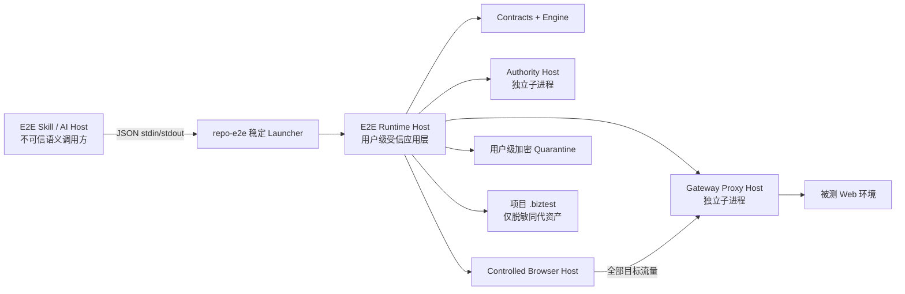

# Spec：可安装、可移植且受信的 E2E Runtime Host

> 状态：待书面审阅
> 日期：2026-07-16
> 规范语言：中文
> 适用仓库：`mutil-skills`
> 上游基线：`2026-07-11-prd-driven-e2e-system-v2.md` 与 `2026-07-15-declarative-e2e-compiler-trust-boundary-design.md`
> 决策：采用“用户级隔离 Runtime Host + 项目侧薄客户端”方案；不建设远程业务后端。

## 1. 文档目的与优先级

现有 E2E Skill、Contracts、Engine、Authority、Gateway 规则、Playwright Runtime 和 Report 已能在本仓库源码环境中组合运行，但用户安装 Skill 后，不能在任意用户项目中通过稳定入口调用这些能力。本文补齐产品化运行层、安装协议、进程边界和跨仓验收标准。

本文只覆盖“Runtime 如何离开源码仓库并安全运行”。PRD 建模、覆盖宇宙、审批内容绑定、浏览器执行、证据、Verdict 和同代发布的业务语义继续遵循上游 V2 Spec。发生冲突时：

1. 安装、运行时发现、进程托管、用户级状态和 Skill 调用方式以本文为准；
2. 需求、Case、执行、证据、报告和发布的领域语义以上游 V2 Spec 为准；
3. 声明式编译器和受信执行边界以 2026-07-15 的设计为准；
4. 本文明确要求原始证据位于 Git 工作区之外，因此替代 V2 逻辑布局中工作区内 `quarantine/` 的位置；工作区内不得创建原始证据目录。

“必须”“不得”“应该”“可以”的含义与 V2 Spec 相同。本文不允许以脚本示例或 Golden fixture 代替生产接口。

## 2. 当前问题与根因

### 2.1 已验证的现状

- `@mutil-skills/e2e-playwright-runtime` 仅导出 TypeScript 库，没有 `bin`，用户和 Skill 没有稳定的命令入口；
- `@mutil-skills/cli` 仅提供 `repo-test`、`repo-tdd` 和 telemetry 相关命令，也不依赖 E2E 包；
- E2E Skill manifest 分别探测七类低层 package/capability，缺失时只能阻塞，不能探测一个可工作的完整产品 Runtime；
- 完整编排主要存在于 `scripts/e2e-*.ts` 和 Golden tests，脚本不在 npm 包的发布闭包内，并包含 fixture 假设；
- Authority 已有认证 RPC Host，Gateway 只有策略与审计库，没有生产代理进程；
- 运行时资产大多已按 `import.meta.url` 或 package resolution 定位，但还没有统一的安装清单、版本锁和 `doctor` 证明。

### 2.2 根因

缺失的不是“再加几个 dependency”，而是一个深模块：它必须把低层 E2E 包组合成稳定的应用协议，并拥有安装、信任根、子进程、状态、Gateway、浏览器、资产和报告的生命周期。若让用户项目直接 import 低层包，项目进程可以自行构造 Authority、Gateway 或测试 session，调用方会变成自己的信任根，现有安全不变量不再成立。

## 3. 目标与完成定义

### 3.1 目标

实现后，用户只安装 E2E Skill 和一次用户级 Runtime，即可在不依赖 `mutil-skills` 源码路径、不修改用户项目 dependency 的情况下完成：

```text
PRD / 已确认语义输入
→ Runtime 能力证明
→ 可恢复的 E2E Run
→ 独立 Authority + 独立 Gateway + 受控 Chromium
→ 脱敏的同代回归资产
→ 可复算、可追踪的最终报告
```

成功必须同时满足：

1. 从 npm tarball 安装 Skill 和 Runtime 后，在空白临时项目中可以调用固定命令；
2. Runtime 执行期间不从用户项目的 `node_modules`、源码仓库或当前工作目录解析任何可执行依赖；
3. Skill 只调用稳定 CLI/JSON 协议，不 import E2E 低层包；
4. Runtime Host 独立持有信任根并托管 Authority、Gateway、Browser 和发布事务；
5. 生成测试不能读取宿主 SSH key、任意环境变量或任意宿主文件；
6. 受控 Chromium 的目标流量必须经过 Gateway，缺失强制代理证明时执行阻塞；
7. 工作区只产生已脱敏、可提交、可追踪的资产，原始证据和密钥始终在用户级受限目录；
8. `doctor --json` 能机器证明版本闭包、权限、Authority、Gateway、Chromium 和文件系统能力；
9. 删除源码仓库、清空 `NODE_PATH` 并切换到空白项目后，Golden 验收仍通过；
10. 任一依赖、协议、签名、摘要或能力不一致都得到结构化 blocked，不降级为不受控执行。

### 3.2 非目标

首个可移植版本不实现：

- 远程 SaaS、常驻云服务或需要业务团队部署的后端；
- Firefox、WebKit 或跨浏览器通过声明；
- 生产环境不可逆写操作；
- 任意手写 Playwright/Node.js 测试进入受信 Profile；
- 自动修改用户业务源码；
- 默认把 Runtime 依赖写入用户项目的 `package.json`；
- 静默联网安装 Runtime 或 Chromium；
- 组织级审批、SSO 管理后台和跨主机分布式运行；
- 在本次实现中直接发布 npm 包、创建 release tag 或推送 registry。

## 4. 方案比较与架构决策

### 4.1 方案 A：把全部 E2E 包加入主 CLI 或用户项目

优点是实现短、Node 解析自然。缺点是 Playwright 和全部 E2E 依赖污染主 CLI；用户项目可通过依赖提升、loader、`NODE_PATH`、patch 或直接 import 低层接口影响信任边界；不同项目容易形成版本漂移。该方案不满足隔离目标，拒绝。

### 4.2 方案 B：打成单一原生可执行文件

优点是入口单一、部署表面简单。缺点是 Playwright、Chromium、ESM、Python 文件系统 helper 和平台资产难以可靠封装；调试、升级、许可证清单和版本迁移成本高。当前没有必要承担这一复杂度，拒绝。

### 4.3 方案 C：用户级隔离 Runtime Host + 项目侧薄客户端

`@mutil-skills/e2e-runtime` 提供 `repo-e2e` bootstrap 和 Host。显式安装后，生产依赖闭包进入 `~/.mutil-skills/runtime/e2e/versions/<version>/`，固定 launcher 位于 `~/.mutil-skills/bin/repo-e2e`。用户项目只保留配置和脱敏资产。Host 通过认证本地通道托管安全组件。

该方案同时满足可移植、可升级、项目无侵入和信任边界要求，确定采用。

## 5. 总体架构



这里的 Host、Authority 和 Gateway 都是用户机器上的临时本地进程，不是需要部署的业务后端。它们存在的原因是把安全决定和不可信测试进程分开；命令结束后由 Host 回收，默认不常驻。

### 5.1 唯一新增产品包

新增 `@mutil-skills/e2e-runtime`，作为唯一公共应用层。主 `@mutil-skills/cli` 保持轻量，不直接依赖 Playwright 或 E2E 包。

```text
packages/e2e-runtime/
  package.json                     # package、bin、发布闭包和精确依赖
  tsconfig.json
  src/
    index.ts                       # 仅导出稳定协议类型、Schema 和版本信息
    protocol.ts                    # request/response/error Schema
    runtime-host.ts                # 唯一编排入口
    runtime-layout.ts              # 用户级/项目级固定布局与 no-follow 校验
    runtime-installer.ts           # 版本化安装、校验、原子切换和恢复
    runtime-discovery.ts           # current 解析与源码仓库隔离证明
    runtime-doctor.ts              # 能力探测与证明
    process-supervisor.ts          # 子进程、超时、信号和回收
    environment-policy.ts          # 子进程 env allowlist 与 secret broker
    authority-host.ts              # Authority 生命周期和审批会话适配
    gateway-proxy-host.ts          # HTTP(S)/WebSocket 强制代理 Host
    browser-host.ts                # Chromium 发现、强制参数和 session
    run-store.ts                   # 用户级 Run journal、恢复和并发锁
    project-publisher.ts           # 调用现有 Artifact Store 发布安全资产
    cli.ts                         # 人类命令到同一协议的映射
    bin/repo-e2e.ts                # shebang 入口
  test/                            # 单元、集成、安全失败和安装测试
```

新增包可以组合现有模块，不得复制 Contracts、Engine、Authority、Gateway policy、Compiler、Sanitizer、Artifact Store 或 Report 的确定性算法。`scripts/e2e-*.ts` 继续作为 Golden driver 或迁移参考，不得被 Runtime import。

### 5.2 依赖方向

```text
E2E Skill → repo-e2e protocol
@mutil-skills/e2e-runtime
  → e2e-contracts
  → e2e-engine
  → e2e-authority
  → e2e-gateway
  → e2e-playwright-runtime
  → e2e-report

禁止：
低层 E2E 包 → e2e-runtime
主 cli → e2e-runtime
Skill → 任意低层 E2E package import
Runtime → 用户项目 node_modules / loader / tsconfig path
```

## 6. 公共调用协议

### 6.1 单一机器入口

稳定机器入口固定为：

```bash
~/.mutil-skills/bin/repo-e2e rpc
```

它从 stdin 读取一个 UTF-8 JSON envelope，在 stdout 只写一个 JSON response；日志和用户提示只写 stderr。人类可读子命令必须映射到同一个 Host 方法，不得形成第二套状态机。

```ts
type RuntimeRequestEnvelope = {
  schemaVersion: '1.0.0';
  requestId: string;
  client: { name: string; version: string };
  command:
    | 'doctor'
    | 'create-run'
    | 'submit-candidate'
    | 'open-approval'
    | 'execute-run'
    | 'resume-run'
    | 'get-status'
    | 'render-report';
  projectRoot?: string;
  payload: unknown;
};

type RuntimeResponseEnvelope = {
  schemaVersion: '1.0.0';
  requestId: string;
  runtime: { version: string; installationDigest: string };
} & (
  | { ok: true; result: unknown }
  | { ok: false; error: RuntimeError }
);

type RuntimeError = {
  code: string;
  category:
    | 'input'
    | 'environment'
    | 'safety'
    | 'automation'
    | 'artifact'
    | 'migration'
    | 'internal';
  terminalState:
    | 'input-blocked'
    | 'environment-blocked'
    | 'safety-blocked'
    | 'automation-blocked'
    | 'artifact-blocked'
    | 'migration-required';
  message: string;
  retryable: boolean;
  resumeState?: string;
  details?: Record<string, unknown>;
};
```

所有 `payload` 和 `result` 必须由 `e2e-contracts` 中的严格 Schema 校验，拒绝额外字段。协议 major 不兼容返回 `E2E_RUNTIME_PROTOCOL_MAJOR_UNSUPPORTED` 和 `migration-required`，不得猜测转换。

### 6.2 命令语义

| 命令 | 语义 | 不得做的事 |
| --- | --- | --- |
| `doctor` | 对安装闭包、权限、平台、Authority、Gateway、Chromium、Artifact FS 做不触碰用户项目和被测目标的探测；可以启动并回收临时本地 canary 子进程 | 不安装、不下载、不执行 Case、不保留 canary Run |
| `create-run` | 绑定真实项目根、Asset、PRD source 和 policy，创建可恢复 Run | 不自动审批、不执行浏览器 |
| `submit-candidate` | 接收当前状态允许的语义候选，调用 Contracts/Engine 验证并推进一条合法边 | 不接受调用方自报 digest/verdict/下一状态 |
| `open-approval` | 打开独立用户在场审批会话，Authority 对重算摘要签名 | 不把 RPC JSON 中的 `approved:true` 当审批 |
| `execute-run` | 重验 freshness、Run Bundle、信任根和能力后启动 Gateway/Browser/Bridge | 不加载任何生成源码或未知动作 |
| `resume-run` | 从 Host journal 和 Engine `resumeState` 恢复 | 不跳状态、不自动重放 effect unknown |
| `get-status` | 返回状态、已验证摘要、下一条合法边和最小阻塞项 | 不产生新领域事实 |
| `render-report` | 从冻结 FinalizationSnapshot 复算并渲染报告 | 不覆盖 Engine verdict |

> **Spec Errata（2026-07-17，Task 5 外审）**：审批命令必须显式携带审批类型，Runtime 只校验该类型是否适用于当前 workflow，不得从 workflow 猜测类型。下列命令表已按此外审结论更正。

人类命令固定为：

```text
repo-e2e install-runtime [--version <exact-version>]
repo-e2e install-browser
repo-e2e identity enroll
repo-e2e project rebind --project <path>
repo-e2e doctor [--json]
repo-e2e start --request <path>
repo-e2e status --run-id <id> [--json]
repo-e2e approve --run-id <id> --type <scope|lineage|privacy>
repo-e2e approve --run-id <id> --type <discovery|execution> --subject-file <project-relative-json>
repo-e2e secret provide --run-id <id> --ref <secret-ref>
repo-e2e resume --run-id <id> --input <path>
repo-e2e report --run-id <id>
repo-e2e uninstall-runtime --version <exact-version>
repo-e2e rpc
```

`start/status/approve/resume/report` 只是 Host 应用接口的命令适配器。`install-runtime`/`uninstall-runtime` 属于 bootstrap 安装协议；`install-browser` 属于显式环境准备；`identity enroll`、`project rebind` 和 `secret provide` 属于独立人机通道，这些命令都不接受 Skill RPC 传入的领域状态跳转。`project rebind` 必须通过 WebAuthn 用户在场验证，只迁移项目身份引用，不迁移或复用旧审批。

### 6.3 进程退出码

- `0`：请求成功，包括合法暂停且 response 明确给出下一步；
- `2`：输入或协议错误；
- `3`：环境阻塞；
- `4`：安全阻塞；
- `5`：资产或迁移阻塞；
- `70`：已脱敏的内部错误。

stdout 不得包含 stack、绝对密钥路径、secret、原始网页内容或原始证据。内部错误的详细诊断只进入权限受限的用户级运行日志，并向用户返回 correlation ID。

## 7. Runtime 安装、发现与升级

### 7.1 显式安装入口

Skill 缺少 Runtime 时，只能解释并请求用户授权执行以下等价安装动作：

```bash
npm exec --yes --package=@mutil-skills/e2e-runtime@<exact-version> -- repo-e2e install-runtime --version <exact-version>
```

不得自动执行、静默联网或使用 `latest`。企业私有 registry 可以替换 registry 来源，但版本仍必须精确。安装程序必须把工作目录切换到用户级 staging，清除 `NODE_OPTIONS`、`NODE_PATH` 和项目 package-manager 配置影响，并以 `--ignore-scripts --omit=dev --save-exact` 安装生产闭包。Chromium 下载必须是独立的显式命令。

### 7.2 固定布局

```text
~/.mutil-skills/
  bin/
    repo-e2e
  runtime/e2e/
    .owner.json
    install.lock
    current.json
    versions/
      0.1.0/
        node_modules/@mutil-skills/e2e-runtime/
        package.json
        package-lock.json
        runtime-manifest.json
    browsers/
      <playwright-version>/
  e2e/
    authority/
    state/<project-id>/<run-id>/
    quarantine/<run-id>/
    logs/<run-id>/
```

目录权限：用户级根、Runtime version、state、quarantine、authority 和 logs 必须为 `0700`；密钥、manifest 临时文件和敏感 state 必须为 `0600`。Windows 不在首期支持范围；macOS/Linux 必须验证 owner UID、普通文件类型、非 symlink 和 group/other 无权限。

### 7.3 安装事务

安装必须按以下顺序完成：

1. 验证 `runtime/e2e` 不为 symlink，owner 是当前 UID；已有目录必须含有效 `.owner.json`，否则拒绝覆盖；
2. 取得跨进程排他 `install.lock`；
3. 在同一文件系统创建 `.staging-<uuid>`；
4. 使用精确版本安装生产依赖闭包，禁止 lifecycle scripts；
5. 从实际 bytes 枚举 version root 内除 `runtime-manifest.json` 自身外的全部普通文件（包括 JS、JSON、Python helper、静态页、native/WASM 和 package metadata），生成逐文件长度与摘要唯一索引；
6. 验证 package 名、版本、依赖版本、协议 major、入口 shebang、文件摘要和禁止的 symlink；
7. fsync 文件与目录后，原子 rename 到 `versions/<version>`；同版本已存在时只允许摘要完全相同的幂等成功；
8. 以 temp→fsync→rename→父目录 fsync 原子写 `current.json`；
9. 安装或更新固定 launcher；launcher 只解析受校验的 `current.json`，再使用绝对路径和 `process.execPath` 启动 Host；
10. 失败时删除 staging，保留上一个 current；启动时恢复中断 staging，绝不删除未知文件。

`current.json` 至少绑定 `runtimeVersion`、`runtimeManifestDigest`、`protocolMajor` 和 version 目录 realpath。降级需要显式 `--version`，不得由普通 Run 自动完成。

### 7.4 一版本规则

首个发布闭包版本固定为 `0.1.0`。以下包必须同时使用 `0.1.0`，内部依赖使用精确版本，不使用 `^`、`~`、workspace 浮动或 `latest`：

- `@mutil-skills/e2e-runtime`
- `@mutil-skills/e2e-contracts`
- `@mutil-skills/e2e-engine`
- `@mutil-skills/e2e-authority`
- `@mutil-skills/e2e-gateway`
- `@mutil-skills/e2e-playwright-runtime`
- `@mutil-skills/e2e-report`

第三方依赖可以在源码开发阶段保留兼容范围，但 `package-lock.json` 和 `runtime-manifest.json` 必须锁定实际版本。Runtime Host 启动时验证所有内部包恰好同版；不一致返回 `E2E_RUNTIME_PACKAGE_VERSION_SKEW`。

### 7.5 运行时发现

稳定 launcher 不使用 PATH 搜索内部命令，不读取项目 package.json，不调用 `npx`，不从 cwd 解析模块。Host 启动时必须：

- `realpath` 版本根和全部入口；
- 验证其均在当前 version root 内；
- 重算 `runtime-manifest` 中关键入口和安全资产摘要；
- 拒绝 `NODE_OPTIONS`、`NODE_PATH`、`--loader`、`--require` 和 project-local preload；
- 以绝对路径启动 Authority/Gateway/Browser helper；
- 在能力证明中记录 `sourceRepositoryIndependent: true`，其证明来自模块 realpath 和 manifest，而非调用方布尔值。

## 8. Runtime Host 与进程生命周期

### 8.1 Host 是唯一信任根装配者

只有 Runtime Host 可以创建：

- Authority state key 和认证 RPC session key；
- Gateway policy session 和代理 endpoint；
- Browser Host trust token、Bridge endpoint 和 Compiler measurement；
- Quarantine key、Sanitizer attestation signer 和 Artifact transaction signer；
- Run journal 的状态转换和恢复锁。

这些构造器和 Host facade 不得通过 `@mutil-skills/e2e-runtime` 公共导出。公共入口只导出协议类型、Schema 和版本信息；程序化调用方也必须启动稳定 launcher 并走同一进程边界。测试专用 factory 只能通过未导出的 test entry 使用，且不能进入 npm `exports`。

> **Spec Errata（2026-07-17，Task 5 二次外审）**：Authority `2.0.0 → 2.1.0` 迁移必须在同一 SQLite transaction 内先严格解析全部嵌套状态、解密并验证全部私钥及既有签名，再提交新 snapshot；错误密钥或任一损坏必须原样回滚。Grant 签发接口不得接收调用方提供的 receipt binding，而要先验证真实 canonical subject，再由 Authority 内部派生 `{ subject, approvalType, subjectDigest }` 并一次性消费私有 receipt。RPC 与人类审批 callback 必须共用完整项目身份比较。global request replay 必须早于 Authority factory，重放不得启动 Authority；单请求 cleanup 独立关闭全部已打开资源，cleanup 失败时只输出一个 cleanup error。若业务 success 已持久化但 cleanup 失败，本次返回 cleanup error，后续同 requestId 重放仍返回已持久化 success，这是持久幂等优先于本次传输结果的明确语义。stdout 一旦开始写入，不得再追加第二份 JSON。Authority 状态目录和 `state.key` 必须由 Runtime 自带的 `openat`/`mkdirat` helper 通过 dirfd 与 `O_NOFOLLOW` 创建/读取；父进程只读固定最终目录 fd，Authority 子进程继承该 fd、`fchdir` 后 `exec`，SQLite 只使用相对 basename 并在打开前后核对 realpath/dev/inode。Runtime npm 根入口仅导出协议 Schema、类型和版本。

> **Spec Errata（2026-07-17，Task 5 三次外审，覆盖冲突旧结论）**：二次外审中的“三字段 `{ subject, approvalType, subjectDigest }` 即足够绑定”结论撤销。Discovery/Execution 的 Runtime `open-approval` 与六类 Grant 签发必须共同使用唯一的 `e2e-canonical-approval-subject/v1` 域和严格、拒绝额外字段的 Grant subject union。人类命令必须通过项目内 no-follow 读取的 `--subject-file` 提交该 subject；Runtime 在打开会话前及 callback 后校验 Asset、PRD revision、Run 绑定并重算同一 digest。WebAuthn 完成后持久化完整 `{ subject, runId, approvalType, subjectDigest, installationDigest, origin, issuedAt, expiresAt }` 回执；回执与 credential counter 在同一 Authority transaction 中提交，以独立 AES-256-GCM AAD 加密进入 `2.2.0` snapshot。签发只接收 session ID，Authority 从实际严格 Grant subject 派生 type/digest，原子 take 回执、精确匹配并把完整上下文写入 Grant 签名；消费与 Grant 提交共用 transaction，失败回滚、重启后仍仅可消费一次。Attempt 日志迁移必须重放 context、sequence、previous chain、时间单调性、started/terminal 状态机、最终 chain digest 和已完成 reservation attestation，删除、重排或跨上下文一律原样回滚。

> **Spec Errata（2026-07-17，Task 5 四次外审，覆盖旧授权迁移结论）**：Grant 的 `approvalContext` 不只在签发时校验，执行时还必须与 Authority/RPC Host 注册的当前可信上下文逐字段匹配；至少覆盖 runId、installationDigest、approvalType、subjectDigest、origin、issuedAt 和 expiresAt。RPC payload 不得自报该上下文，Host 必须从已认证客户端注册记录读取；生产绑定在 Authority 实际 take WebAuthn receipt 时更新，receipt 的 runId 来自 Runtime 对 Run Store 快照的审批请求，installationDigest 来自已固定安装，origin 与时间来自 WebAuthn Authority。Parent/client 只携带其可证明且不含秘密的 `{ runId, installationDigest, approvalType, subjectDigest }`，不得要求 parent 猜测 child 生成的 origin/issuedAt/expiresAt；最终放行仍由 Server 的完整 receipt exact match 决定。Runner 与 Gateway 还要与可信 Runtime/Attempt 的 runId 交叉验证。Authority `2.0.0/2.1.0` snapshot 中没有完整 `approvalContext` 的旧 Grant 不得猜测补值继续使用：迁移先严格解析、解密并验证旧签名域和 Attempt 链，再保留可独立验证的密钥、身份、credential 和人工结果状态，同时清空 grants/uses/reservations/completedPreflights/attemptLogs，并为全部旧 grantId 写入迁移撤销 tombstone，强制重新审批。任何旧 Grant 在迁移后都必须返回 revoked/denied。

> **Spec Errata（2026-07-17，Task 5 五次外审，补齐生产最终化链）**：Runtime/CLI 打开审批会话时只能把自身可证明的 `{ runId, approvalType, subjectDigest, installationDigest }` 交给 child；不得预传 Grant subject、approver 或完整 approvalContext，也不得保留任何可向生产 Host 注入审批上下文的 test-only 选项。WebAuthn 完成后，parent 必须以严格 Grant subject 显式调用一次性 `finalize-approval`；child 对打开时的四字段重新绑定，并在同一 Authority SQLite transaction 内完成 receipt take、Grant 签发以及 RPC Server 完整 approvalContext 注册。注册或提交任一步失败，receipt、Grant 和注册状态必须共同回滚；完成前、错误 subject 和重放均拒绝。child 返回的 SignedGrant 与四字段 binding 必须从 Authority 生成的 `approvalContext` 派生，Runtime 再与 Run/安装/subject 精确复验，并将人类审批结果持久化进 Run Store，重放不得再次消费会话。真实 `2.0.0/2.1.0` Grant 的旧 subject digest 使用 `approval-subject/v1` 域校验，迁移验证旧签名后仍按四次外审规则撤销，不得以当前 canonical 域伪造 legacy fixture。Authority child 清理必须在 listener 尚未建立、部分启动或多个 close 失败时仍独立尝试 WebAuthn revoke、所有审批 server、HTTP、RPC destroy、Approval Authority 与 Lease Authority，并聚合错误而不覆盖原始 startup failure。Task 5 Golden 必须通过真实 WebAuthn assertion 串起 receipt→finalize→SignedGrant→RPC verify/reserve；若宿主安全策略禁止 loopback/Chromium，应把该环境阻塞与产品失败明确分开，不得把 sandbox skip 记为通过。
>
> Authority/Artifact FS 的 Python helper 不得硬编码单一路径或信任 `PATH`：Runtime 只枚举固定绝对候选，验证 root owner、不可被 group/world 写、普通文件内容摘要和所需 `dir_fd/O_NOFOLLOW/fchdir/pread/pwrite/fsync` 能力，并在每次 spawn 前复验；Doctor 记录该证明 digest。helper 创建目录或 key 后必须 fsync 文件与包含目录。Authority child 的关闭顺序固定为 shutdown→TERM→KILL 并等待退出；启动失败、父 fd 关闭失败和人类审批任一资源失败都必须独立回收全部已打开资源。WebAuthn body/chunk、helper stdout、state/session key Buffer 必须在最早可行的 `finally` 中清零。
>
> SQLite basename 使用 `O_NOFOLLOW` 预开、regular/nlink=1/UID/mode/fd-path identity 校验、fd `chmod(0600)` 和打开后复验。**残余边界**：Node `DatabaseSync` 只能按 pathname 打开，不能把已验证 fd 交给 native VFS；因此在 current-UID 0700 目录内，同 UID 恶意进程仍可能在“预检 fd—native open”窗口主动替换 leaf。实现必须检测替换后 fail closed、不得继续初始化/写入替换文件，但在获得可靠 fd-backed VFS 前不得宣称消除了该竞态；此同 UID 主动对手属于明确记录的宿主账户信任残余。

### 8.2 子进程模型

每个执行 Run 使用一个 Host 父进程，按需启动 Authority、Gateway 和 Controlled Browser 子进程。Host 必须：

- 通过绝对入口和最小 env 启动；
- 为每个子进程生成独立随机 session key；
- 只绑定 `127.0.0.1`/`::1` 随机端口，拒绝非 loopback；
- RPC 同时校验 MAC、nonce、时间窗、request ID 和服务端签名；
- 超时或父进程断开时关闭 listener、撤销 session、终止 Browser，并把未完成写 reservation 标记 unknown；
- 先正常 shutdown，超时后再终止，不遗留可复用代理；
- 不把 endpoint、session key 或私钥写入项目资产。

默认不运行用户级 daemon。每条命令打开持久 state、取得 Run lock、执行一条原子操作后退出；浏览器执行期间 Host 保持前台，崩溃后由下一次 `resume-run` 恢复。

### 8.3 运行锁与幂等

同一 `projectId + runId` 同时只允许一个写 Host。请求 envelope 的 `requestId` 在 Run journal 内去重：相同 requestId 和相同请求摘要返回原结果；相同 requestId 不同摘要返回 `E2E_RUNTIME_REQUEST_REPLAY_MISMATCH`。读命令可以并发，但必须读取同一 committed snapshot。

## 9. Gateway Proxy Host

### 9.1 职责

`@mutil-skills/e2e-gateway` 继续提供 policy、canonical request、effect 和审计逻辑；新增 Runtime 内的 `gateway-proxy-host.ts` 只负责生产传输：

- 在 loopback 启动每 Run 独立的 HTTP forward proxy；
- 对 HTTP、HTTPS、WebSocket 和浏览器导航统一执行现有 Gateway 决策；
- 默认拒绝未列入批准 policy 的 origin、method、path、transport 和 effect；
- 真实模式只 forward，不加载 injection；注入模式只对签名规则命中请求注入；
- 每个请求绑定 Host 生成的 run/case/action/attempt correlation；
- 写请求在转发前通过 Authority RPC 验证、reserve 和 Lease fencing；
- 记录 signed gateway audit，并在完成/unknown 后关闭 session。

### 9.2 强制代理证明

受控 Chromium 必须由 Host 以固定参数启动：代理 endpoint、禁用 QUIC、禁用未知扩展、隔离 user-data-dir、固定 DNS/host resolver 策略，并禁止调用方追加参数。Browser Host 必须在执行前通过 Gateway canary 证明：

1. 允许目标请求确实到达本次 Gateway；
2. 未允许目标被 Gateway 阻断；
3. DNS、WebSocket、Service Worker 和 Beacon 的适用路径受同一策略控制；
4. Chromium measurement 中的 proxy endpoint digest 与 Gateway session 一致。

任一证明缺失返回 `E2E_GATEWAY_ENFORCEMENT_UNPROVEN` 和 `safety-blocked`。仅设置 Playwright route、仅依赖页面内 mock 或调用方自报 `gatewayConnected:true` 均不构成证明。

### 9.3 HTTPS

Gateway 使用每安装独立、本地保存的 CA material，为每 Run 生成短期叶证书；不得修改系统信任库。Chromium 只在本次隔离 profile 中信任对应 SPKI。CA 私钥位于 `~/.mutil-skills/e2e/authority/` 且为 `0600`，不传入 Browser/Compiler/用户项目。证书生成或 HTTPS 解密能力不可用时，HTTPS Case 必须安全阻塞，不能退化为直连。

### 9.4 威胁边界说明

本设计防御 PRD、页面、生成候选、项目依赖和受控测试进程；不声称防御已完全控制当前 OS 用户账号或 root 的攻击者。同一 OS 用户证明的报告范围仍是“本地个人 Authority”，不得描述为组织级不可抵赖。

## 10. Browser、Compiler 与宿主资源隔离

### 10.1 权威验收不执行生成源码

Skill/模型只提交声明式 Requirement、Case、Action 和 Oracle。Host 重算 digest，验证审批与 freshness。权威浏览器执行只由当前 Runtime 自带的固定 Runner 解释已批准 Action Map，并通过同 session 派生的 Bridge 调用受控 Chromium；它不得加载、import 或执行任何生成的 Playwright/Node.js 源码。

固定 Projector/Compiler 在权威执行事实冻结后，才在空 staging 目录生成可提交的 Playwright 回归资产。Compiler output 必须通过 content digest、token 级安全扫描、import allowlist 和 `playwright test --list` 集合审计；`--list` 只能在无目标网络、无 secret、只读 Runtime、临时可写目录的低权限子进程中运行。这些检查只证明发布资产与已批准 Case 对齐，不能产生或覆盖本次浏览器事实、Evidence、CaseResult 或 Verdict。

项目内现有测试、用户修改后的生成文件、任意 hook、reporter、fixture、global setup 和自定义 Node loader 都不得进入受信执行。用户后续独立运行 published regression 属于普通项目测试 Profile；其结果只有经过一次新的 Runtime Run、重新审批和同次证据绑定，才能成为新的权威验收事实。

### 10.2 文件系统隔离

Browser/Runner 工作目录位于用户级 Run staging，不是项目根。子进程可见路径采用默认拒绝 allowlist：

- 只读：当前 Runtime version、冻结 source cache、密封 Run Bundle；
- 读写：本 Run staging、隔离 browser profile、加密 quarantine；
- 发布写入：只能通过 Artifact Store 的受控 dirfd session 写 `.biztest`；
- 禁止：`~/.ssh`、`~/.aws`、`~/.config`、其他项目、任意 `/Users`/`/home` 遍历、项目 `.git` 和未批准绝对路径。

权威执行不存在生成测试进程；固定 Runner 不向 Action Map 暴露 `fs`、`child_process`、`net`、`tls`、`worker_threads` 或动态 import 能力。回归资产的 `playwright test --list` 子进程在 macOS 使用 Runtime 生成的 Seatbelt profile，在 Linux 使用 bubblewrap 的 user/mount namespace、只读 bind 和独立临时 HOME；该子进程始终禁用目标网络。对应隔离器、Chromium sandbox 或文件系统证明不可用时，受信 Profile 返回 `E2E_RUNTIME_ISOLATION_UNAVAILABLE`；不得把普通 Node 权限当作等价隔离。

### 10.3 环境变量与秘密

Host 启动子进程时从空对象构建 env，只允许固定的无敏感键，例如 locale、受控临时目录和 Runtime 内部一次性 handle。以下内容一律不继承：

- `SSH_*`、`AWS_*`、`GITHUB_*`、`NPM_*`、云凭证、数据库 URL；
- `NODE_OPTIONS`、`NODE_PATH`、`PATH` 中的项目 bin；
- 用户 shell 自定义变量和项目 `.env`。

业务登录凭证只能以 `secretRef` 出现在模型和资产中。首期 Secret Broker 只支持两种来源：`repo-e2e secret provide` 的隐藏交互输入，或用户预先显式绑定的 macOS Keychain/Linux Secret Service 条目。交互值只存入以每 Run key 加密的用户级 state，系统条目按固定 ID 单次读取；两者都通过一次性 Bridge 操作注入页面。明文不进入 stdin/stdout、Run Bundle、trace、report、生成测试源码或普通 Runtime log。环境变量 provider 和项目 `.env` 首期明确不支持；缺失 provider 必须阻塞，不允许回退到“把全部 `process.env` 传给测试”。

### 10.4 Chromium 安装

`repo-e2e install-browser` 使用当前已安装 Runtime 内 Playwright 的绝对 CLI，下载到版本化用户级 browser root，并记录 browser executable bytes digest、Playwright version 和平台。`doctor` 只探测，不下载。Runtime 升级后若 Playwright revision 不兼容，明确返回恢复命令。

## 11. Authority 与人工审批

RPC 中的 `approved: true`、普通文件、环境变量和 Agent 文本都不是审批。`open-approval` 只创建绑定实际 subject digest 的一次性 approval session；真正签名必须来自 Authority Host 的独立用户在场通道。

首期本地实现采用 loopback 审批页 + 平台 WebAuthn authenticator：

1. 用户先通过 `repo-e2e identity enroll` 在固定 RP ID `localhost` 下登记一个要求 user verification 的 WebAuthn credential；Authority 只保存 public credential、counter 和本地身份映射；
2. Authority 为每次审批生成一次性 challenge，并只在当前随机 loopback port 提供静态审批页；实际 origin 必须与 session 中登记的 `http://localhost:<port>` 精确相同；
3. 页面显示 scope、环境、Case/Action、写入、注入、cleanup、证据和摘要；
4. 审批人在 macOS 使用 Touch ID/安全密钥，或在受支持 Linux 桌面使用安全密钥完成 user verification；
5. Authority 验证 origin、RP ID、challenge、user-verification flag、counter、credential allowlist 和签名后签发 grant；
6. challenge 单次消费、最长 5 分钟，并绑定 runId、approval type、subject digest 和 Runtime installation digest；
7. 没有已登记 credential、可用 WebAuthn user-verification 或精确 origin 时返回 `E2E_APPROVAL_USER_PRESENCE_UNAVAILABLE`。

本地 TTY 仅用于展示恢复命令和状态，不得作为受信审批签名来源。SSO/组织审批不在首期范围；后续扩展只能实现同一 `ApproverSessionAuthenticator` 接口，不能改变领域 grant Schema。

## 12. 项目资产、用户级状态与可追踪性

### 12.1 项目内允许内容

沿用 V2 的项目布局：

```text
<project>/.biztest/
  project.json
  assets/<prd-id>/
    lock
    journal.json
    active-a.json
    active-b.json
    active-slot
    validation-refs.json
    generations/<generation-id>/
      requirements/
      regression/
      run/contracts/
      run/results/
      run/evidence/       # 仅已脱敏且 scanner 通过
      run/report.md
      run/report.html
      run/final-report.json
      generation-manifest.json
      .publication-integrity.json
```

项目配置必须是严格 JSON，不执行 JS/TS config。Runtime 只允许在用户明确选择的项目根下访问固定 `.biztest` 子树，并继续使用现有 no-follow、dirfd、lock、journal、fsync 和双槽 active 协议。

### 12.2 项目外内容

以下内容只能位于 `~/.mutil-skills/e2e/`：Authority/Lease 状态和私钥、Runtime logs、raw trace/video/DOM/network、quarantine encryption key、browser profile、代理 CA、RPC session 和未完成 Run journal。项目内出现 raw evidence、私钥或 session secret 时发布必须失败。

Host 对项目根执行 `realpath` 和 no-follow 校验，并把 `realpath + filesystem device/inode + .biztest/project.json identity` 的 canonical digest 作为本机 `projectId`。绝对路径只保存在用户级 state，项目 generation 和报告只登记 `projectIdentityDigest`。项目被移动、复制或 inode 改变后必须显式 rebind，并使旧审批失效；不得只凭调用方提供的字符串 projectId 复用 Run。

### 12.3 追踪字段

每个 published generation 和 final report 必须额外登记：

- `runtimeVersion`、`runtimeInstallationDigest`、`protocolVersion`；
- `contractsVersion`、`engineVersion`、`playwrightVersion`、`chromiumDigest`；
- `gatewayPolicyDigest`、`authorityPublicKeyDigest`；
- `projectIdentityDigest`、`sourceRevisionDigest`、`runId`、`generationId`；
- `sourceRepositoryIndependent` 证明结果；
- 受信 Profile 的隔离能力证明和明确 `cannotClaim`。

报告不得包含用户 home 的绝对路径、registry token、npm cache 路径、原始 evidence 路径或 secret provider 标识。

## 13. Skill 与 Manifest 集成

### 13.1 单一能力门

E2E Skill manifest 不再要求调用方逐个安装低层 E2E 包。它只声明：

```json
{
  "capability": "e2e.runtime-host",
  "satisfiedBy": [
    "~/.mutil-skills/bin/repo-e2e doctor --json",
    "verified installation manifest + protocol major + safety probes"
  ],
  "whenMissing": {
    "action": "prompt-install",
    "terminalState": "environment-blocked",
    "reasonCode": "E2E_RUNTIME_HOST_UNAVAILABLE"
  }
}
```

现有细粒度 capabilities 仍由 `doctor` 内部探测并返回，但不是 Skill 直接 import 或分别解析的安装契约。Schema 需要新增 `prompt-install` 动作；该动作只生成建议和精确命令，执行仍需用户授权。

### 13.2 Skill 调用约束

Skill 主文档和相关子 Skill 必须统一改为：

- 启动时先调用 `doctor`；
- 每一步只向 `repo-e2e rpc` 提交当前状态需要的结构化输入；
- 原样转述 Runtime 的 state、digest、blocked、resumeState 和 next edge；
- 不计算 SHA、覆盖率、审批有效性、verdict 或 publication state；
- Runtime 缺失时进入 docs-only 并提供安装/恢复命令；
- 不建议用户在项目中安装七个低层 E2E package；
- 不通过 shell 拼接不可信 PRD、路径、selector 或 secret，全部走 JSON stdin。

## 14. `doctor` 能力证明

`doctor --json` 必须返回有 Schema 的 `RuntimeDoctorReport`，至少包含：

| 探测 | 通过条件 | 失败分类 |
| --- | --- | --- |
| installation | current、manifest、关键摘要、owner/permission 全部一致 | migration/environment |
| version closure | 七个内部包版本与 protocol major 一致 | migration |
| source independence | 所有入口 realpath 在 version root，未使用 cwd/node_modules/NODE_PATH | safety |
| authority | 独立进程可启动、key/state 不在项目、签名 canary 可验 | safety |
| approval presence | WebAuthn RP 配置和已登记 credential 可用；不触发审批 | safety |
| gateway | 独立代理启动、deny canary、signed audit、关闭回收通过 | safety |
| chromium | 已安装 executable digest、sandbox 和固定参数 probe 通过 | environment |
| isolation | 文件系统、env、process、network profile 可证明 | safety |
| artifact fs | 本地 POSIX、lock、dirfd no-follow、fsync helper 可用 | artifact |
| quarantine | Git 外、0700、加密 key provider 和 canary 可用 | safety |
| report | renderer 和 Contracts schema 可加载 | environment |

报告中的每项包含 `status: passed|blocked|not-installed`、稳定 reason code、证明 digest 和不含敏感信息的 remediation。顶层 `ready` 只有全部必需项 passed 时为 true。

## 15. 故障、恢复与卸载

### 15.1 Fail closed

Host 捕获已知错误并映射到稳定 code；未知异常只能返回 category `internal`、terminalState `environment-blocked` 和 code `E2E_RUNTIME_INTERNAL_ERROR`，并附不含敏感信息的 correlation ID。以下情况永远不得自动重试：审批签名不一致、effect unknown、Gateway enforcement 未证明、raw evidence 泄漏、Artifact digest 不一致、Authority state 损坏、版本漂移。

只读且已证明无 effect 的幂等 RPC 可以按既有 retry policy 重试。恢复必须以 Engine `resumeState`、Host journal 和 Authority 持久状态三方一致为前提。

### 15.2 崩溃恢复

下次命令按顺序：

1. 验证 Runtime installation 和 Run state owner/permission；
2. 清理失效 loopback endpoint、browser profile lock 和安装 staging；
3. 读取 Authority reservations，把未完成写请求标记 unknown；
4. 调用现有 Artifact Store recovery；
5. 重验 frozen artifact digest 和 Engine resume edge；
6. 只返回安全的下一动作，不自动执行 Case 或重签审批。

### 15.3 卸载

`repo-e2e uninstall-runtime --version <version>` 只删除具有有效 owner marker 和 manifest 的指定 version；current version 必须先显式切换或使用 `--activate <other-version>`。state/quarantine/authority 默认保留。删除 raw quarantine 或 Authority identity 必须使用独立、明确、可审计的销毁命令，不能和 Runtime 卸载绑定。

## 16. 打包、发布与兼容性

### 16.1 npm 发布闭包

`@mutil-skills/e2e-runtime` tarball 必须包含自身 `dist/src`、bin、静态审批页、Schema/模板和运行所需 helper；所有 package-relative asset 均通过 `import.meta.url` 定位。发布 QA 必须对每个 workspace 执行 `npm pack --dry-run`，并对 Runtime tarball做实际隔离安装/import/CLI smoke。

Golden scripts、test fixtures、源码 `.ts`、本地 `dist` 缓存、`.env`、证书和浏览器 binary 不进入 tarball。Chromium由 `install-browser` 单独管理。

### 16.2 兼容规则

- Runtime protocol、Contracts Schema 使用 SemVer；major 不兼容必须迁移；
- Skill manifest 声明支持的 Runtime protocol major 和最小精确发行版本；
- Runtime 可以读取同 major 的旧 state，并在写入前执行确定性迁移；没有迁移器则阻塞；
- active generation 不因 Runtime 升级自动重写；只有新 Run 才产生新 generation；
- 每次发行写人类可读 changelog，列出 Added/Changed/Fixed/Security 和迁移影响。

## 17. 测试策略

所有行为变更采用 TDD。每个实现切片先写会因缺失行为失败的测试，再实现最小代码，并保持全仓 typecheck、build 和 architecture lint 可通过。

### 17.1 单元测试

- 协议 strict parsing、额外字段、版本 major、错误/退出码映射；
- 安装 layout、owner、permission、symlink、digest、同版幂等、降级和 current 原子切换；
- env allowlist、secret redaction、绝对入口解析和 project `node_modules` 拒绝；
- requestId 去重、Run lock、journal checksum 和恢复；
- Skill manifest 的单一 capability 和中文安装说明。

### 17.2 集成测试

- 在 temp HOME 安装 Runtime，删除 bootstrap cache 后由固定 launcher 完成 `doctor`；
- 向项目 `node_modules` 放置同名恶意包、设置 `NODE_PATH/NODE_OPTIONS`，证明 Runtime 拒绝或不加载；
- Authority/Gateway 分进程认证、错误 key/replay/过期 nonce 均拒绝；
- Gateway allow/deny/inject、HTTP/HTTPS/WebSocket canary、审计签名和关闭回收；
- Runner 无法读取 SSH canary、宿主 env canary 和项目外 file canary；
- Chromium 直连 canary 失败且 Gateway 路径成功；
- WebAuthn approval challenge 错绑、重放、无 user verification 和过期均拒绝；
- raw evidence 只能写用户级 quarantine，sanitized bytes 才能进入 generation；
- Host 崩溃后 resume 不重放 effect unknown。

### 17.3 空白用户项目跨仓 Golden

最终门禁必须创建两个相互独立的临时目录：发布源和用户项目。流程固定为：

1. 从 clean build 生成全部 npm tarballs；
2. 在 temp HOME 通过 tarball 安装 Runtime，不使用 workspace symlink；
3. 删除或重命名发布源可访问路径，清空 `NODE_PATH`；
4. 创建无 `package.json`/`node_modules` 的空白用户项目；
5. 从固定 launcher 执行 `doctor --json`；
6. 启动独立 fixture Web 应用，提交最小 PRD 和批准的只读 Case；
7. 通过独立审批测试适配器完成审批；生产 WebAuthn 不被测试 factory 替代；
8. 真实 Chromium 请求经过 Gateway，生成 screenshot/DOM/audit；
9. 编译并独立执行 published Playwright regression；
10. 发布 `.biztest` generation 和 report；
11. 审计所有文件，断言没有发布源路径、temp HOME secret、raw evidence 或额外文件；
12. 从 report 反向追踪 PRD source→REQ/RULE→obligation→Case/Action→result/evidence→verdict。

跨仓 Golden 未通过时，不得宣称“E2E Skill 可在用户项目直接调用”。

### 17.4 安全回归矩阵

至少包含：恶意 PRD shell 文本、路径穿越、symlink swap、恶意项目 package、loader 注入、env secret、SSH key canary、Gateway 直连、Service Worker/WebSocket/Beacon、审批重放、stale grant、浏览器/Runtime 版本漂移、raw evidence 泄漏、发布中断和同版安装内容冲突。

## 18. 实施切片与每片可验收结果

本文是一份单一产品能力 Spec，各切片共享协议和信任根，不拆成相互独立产品：

1. **协议与 Doctor 骨架**：新增 package、稳定 envelope、错误码和只读探测；不执行浏览器；
2. **版本化安装与固定 Launcher**：temp HOME 安装后可在空白 cwd 运行；
3. **Authority/Run Store 托管**：真实持久 state、认证 RPC、幂等和恢复；
4. **Gateway Proxy Host**：先 HTTP deny/allow，再 HTTPS/WebSocket 与强制代理证明；
5. **Browser/Compiler/隔离**：固定 Runner、env/fs/secret boundary 和同次证据绑定；
6. **完整应用编排**：把现有 Golden driver 中的通用流程迁入 Host，删除 fixture 假设；
7. **Skill/Manifest 集成**：单一 capability、安装恢复、中文子 Skill 调用协议；
8. **发布资产和报告**：Runtime provenance、Git 外 quarantine 和完整 final report；
9. **空白项目 Golden 与发行 QA**：tarball、source-independent、恶意项目和安全矩阵全部通过；
10. **版本/changelog**：E2E 包统一 `0.1.0`，但不执行 registry publish。

每片都必须保持仓库可 build、可 typecheck、既有 656+ 测试与 24 个 Golden 不回退；具体测试数以实施时新增测试为准，不能把固定数量当通过替代物。

## 19. 架构不变量

1. Skill 是语义编排者，不是 Runtime、Authority、Gateway、Compiler 或 Verdict Engine；
2. 用户项目不是信任根，不能通过 import 低层 package 伪造受信执行；
3. Runtime 安装和 Chromium 下载都必须显式、可审计、精确版本；
4. Runtime 的可执行依赖只来自当前受校验 version root；
5. Authority 和 Gateway 必须与 Browser/Runner 分进程，且 Runner 不持有其信任根；
6. 审批必须绑定重算内容摘要和独立用户在场证明；
7. Runtime 的权威执行不得加载生成测试；发布的生成测试不得包含读取任意宿主文件、env 或绕过 Gateway 的能力；
8. 目标流量强制经过 Gateway，无法证明即安全阻塞；
9. raw evidence、密钥和 state 不进入 Git；
10. published regression、results、evidence 和 report 必须属于同一 generation；
11. Verdict 只能由 Engine 从冻结事实复算；
12. 任一能力缺失只能 blocked，不能自动降级；
13. 本地进程不是远程业务后端，用户无需部署服务；
14. Runtime 不依赖源码仓库、项目依赖或当前工作目录。

## 20. Definition of Done

只有以下条件全部成立，问题才算解决：

- 新 Runtime package、固定 launcher、版本化安装、显式 browser 安装和 `doctor` 均有生产实现；
- Authority、Gateway、Browser 和 Run state 由 Host 实际托管，不是 mock 或 Golden-only helper；
- Skill 通过稳定 JSON 协议完成一个 PRD→Case→执行→资产→报告的闭环；
- 空白项目跨仓 Golden 在没有源码仓库和项目 `node_modules` 的情况下通过；
- 恶意项目、env/SSH canary、Gateway bypass、审批重放和 raw evidence 泄漏测试全部 fail closed；
- `npm test`、`npm run typecheck`、`npm run build`、`npm run lint:architecture`、`npm run e2e:golden` 全部通过；
- 实际 npm pack 清单和隔离安装 smoke 通过；
- 所有 E2E 包版本一致，协议/迁移/changelog 完整；
- 代码审查没有 P0/P1，Spec 条款有测试或明确人工验收映射；
- 工作区 clean，提交历史按增量切片可独立审查和回滚；
- 未经用户另行授权，不发布 registry、不创建 tag、不推送远端。

达到上述条件后，才可以对用户表述：**E2E Skill 的 Runtime 已可安装到用户级隔离目录，并能从任意用户项目通过稳定入口执行 PRD 驱动 E2E，生成可追踪测试资产和报告。**
